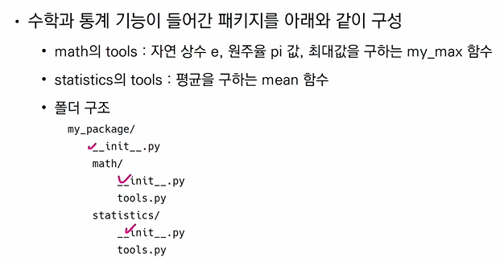
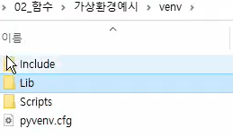

# 0119 2. 함수_모듈


# 모듈

다양한 **기능**을 하나의 **파일**로

# 패키지

다양한 **파일**을 하나의 **폴더**로

# 라이브러리

다양한 **패키지**를 하나의 **묶음**으로


모듈 < 패키지 < 라이브러리


## 개요

- 모듈과 패키지
- 파이썬 표준 라이브러리
- 가상환경
- 유용한 패키지와 모듈
- 사용자 모듈과 패키지

전반적으로 ' 이해 '


# 모듈과 패키지

- **모듈**
  - 특정 기능 코드를 파이썬 파일(.py) 단위로 작성한 것
- 패키지
  - 특정 기능 관련 여러 모듈의 집합
  - 패키지 안에 또 다른 서브 패키지 포함


## 모듈과 패키지 불러오기

- import module
- from module import var, function, Class
- from module import *


- from package import module
- from package.module import var, function, Class


## 활용

```python
# 로또 번호 추출
import random
print(random.sample(range(1, 46), 6))
```

```python
# pprint
# import pprint
from pprint import pprint
a = {'a' : ['apple'], 'c' : 'banana', 'c': 'car', 'd': 'drive', 'e': ['error', 'eat']}
#print(a)

#pprint.pprint(a)
```


### [파이썬 표준 라이브러리](https://docs.python.org/ko/3/library/index.html)

내용 확인하기!


### **파이썬 패키지 관리자(pip)**

- 외부 패키지 설치 시스템

  - $ pip install SomePackage

  - $ pip install SomePackage==1.0.5

  - $ pip install 'SomePackage==1.0.4'
    - 모두 bash, cmd, 터미널 환경에서 사용되는 명령어 ($ 사인)

- 패키지 삭제
  - $ pip uninstall SomePackage
- 설치된 패키지 목록, 특정 패키지 정보 (눈으로 보는 것)
  - pip list
  - pip show SomePackage
- 패키지 freezw (설치 목록) (축약해서 보여줌. 인스톨할 때의 버전 얼음땡)
  - 설치된 패키지의 비슷한 목록을 만들지만, pip install에서 활용되는 형식으로 출력
  - 해당 목록을 requirements.txt(관습)으로 만들어 관리함
  - $ pip freeze
- 패키지 관리
  - $ pi freeze > requirements.txt (txt 파일로 저장)
  - $ pip install -r requirements.txt (txt파일 받아서 있는대로 동일하게 설치 가능)


PyTorch에도 오픈소스 들어가면 pip install 환경 갖출 수 있다.


## 사용자 모듈과 패키지

#### 모듈 만들기 - check

```
NAME = 'HANNA'

def odd(n):
	return n%2 == 1

def even(n):
	return n%2 == 0
```


 ```python
 import check #만들어놓은 모듈 가져올 수 있음
 
 check.NAME # 'HANNA'
 
 check.odd(2) # False
 
 NAME # 'HANNA' # 그러나 import 없으면 에러
 
 ###
 from check import * # *은 그 파일에 있는 모든 것 활용하겠다.
 ```


#### 패키지

- 패키지는 여러 모듈, 하위패키지로 구조화
- 모든 폴더에는 `__init__.py`를 만들어 패키지로 인식
  - python 3.3 부터는 안해도되지만? 웬만하면 하길



(추후 장고할 때)


#### 패키지 만들기

폴더명 02_01_패키지 > my_packahe > math > 

`__init__.py`, `variable.py`, `math.py`

```python
# math.py

PI = 3.141592
E = 2.71

def add(a, b):
	return a + b
	
def minus(a, b):
	return a - b
```

```python
# 01.py
from my_package,.math import math

print(math.math.PI)
```


# 가상환경

- 파이썬 표준 라이브러리가 아닌 외부 패키지, 모듈 사용 시 모두 pip로 설치해야 하는데,
- 복수 프로젝트 시 버전이 상이할 수 있음. 이러한 경우 가상환경 만들어 프젝 별 독립 패키지


### 가상환경 생성

- 특정 폴더에 생성하면, 해당 디렉토리에 별도 파이썬 패키지가 설치됨

  - $ python -m venv <폴더명>

  

  - 원래 저어기 파이썬에 있는 걸 찾아오던 애가, 이 폴더에서 찾아오기 시작함
  - (저어기 파이썬: C드라이브, python, local, programs python, python39, library)

- (여기서 pip install notebook 을 하게 되면 새로 설치된다...)


# 정리

패키지 설치, 삭제, 목록보기는 pip list, freeze, install, uninstall...

교재는 추후 자습서처럼 볼 수 있는 형태


모듈, 패키지, 라이브러리

패키지 활용 공간을 각자 폴더로서 만들어 관리하는 것이 '가상환경'이다.

특정 프로젝트만을 위해 사용할 패키지들을 잘 관리하기 위해 독립된(혹은 고립된) 가상의 공간을 만든다고 보면 됨. 따라서 컴퓨터 전역에 설치된 주피터와 특정 가상 환경에 설치된 주피터는 (버전이 같아도) 다른 패키지가 될 수 있다.