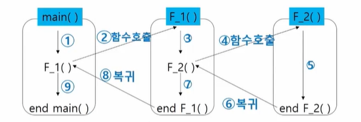
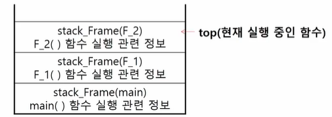
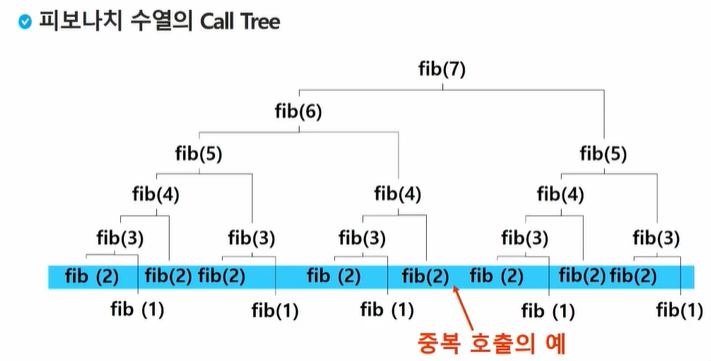

# 0409 TIL

## 목차

1. [스택](1. STACK)
2. [재귀호출](2. 재귀호출)
3. Memorization
4. [DP](4. DP (Dynamic Programmin 동적 계획법))


## 1. STACK

- 자료를 쌓아 올린 형태의 자료구조
- 선형구조(자료 간 관계 1:1)임. (<-> 비선형구조(자료 간 관계 1:N))
- 후입선출 LIFO


### 자료구조

- 자료를 선형으로 저장할 저장소
  - 배열 사용 가능
  - 마지막 삽입 원소의 위치 = top


### 연산

- 삽입 (push) - 저장소에 자료를 저장
- 삭제 (pop) - 저장소에서 자료를 꺼냄 (삽입한 역순으로)
- 공백인지 확인 (isEmpty)
- top item 반환 (peek)


### 알고리즘

- push

  ```python
  def push(item):
  	s.append(item)
  ```

  

- 참고 (크기를 정해놓으면 더 빠르니까)

  ```python
  def push(item, size):
      global top
      top += 1
      if top == size:
          print('overflow')
      else:
          stack[top] = item
          
  size = 10
  stack = [0] * size
  top = -1
  
  push(10, size)
  top += 1		# push(20)
  stack[top] = 20 #
  
  ```

  

- pop

  ```python
  def pop():
  	if len(s) == 0 :
          # underflow
          return
      else :
          return s.pop(-1)
  ```

- 참고 (배열 크기를 정해놓고 넣고 빼는 게 가장 빠르다)

  ```python
  def pop():
      global top
      if top == -1 :
          print('underflow')
          return 0
      else :
          top -= 1
          return stack[top+1]
      
  print(pop())
  
  if top > -1 :			#pop() 		# while top >= 0
      top -= 1							# n = stack[top] # top -= 1
      print(stack[top+1])
  ```


- 스택 구현 고려사항
  - 1차원 배열을 사용하여 구현하면, 구현은 편한데, 스택 크기 변경이 어렵다
  - 래결 방법 : 저장소를 동적으로 할당하여 스택을 구현하는 방법.
    - 동적 연결 리스트를 이용
    - 구현이 복잡하지만 메모리를 효율적으로 사용


### 스택의 응용1 : 괄호 검사

- 괄호의 종류 : 대괄호, 중괄호, 소괄호
- 조건
  1. 왼쪽 괄호 개수 = 오른쪽 괄호 개수
  2. 같은 괄호에서 왼쪽 괄호는 오른쪽보다 먼저 나와야 한다.
  3. 괄호 사이에는 포함 관계만 존재
- 알고리즘 개요
  - 문자열을 차례대로 조사하면서
    - 왼쪽 괄호를 만나면 스택 삽입
    - 오른쪽 괄호를 만나면 스택에서 top 괄호를 삭제한 후 오른쪽 괄호와 짝이 맞는지 검사
  - 스택이 비어 있으면 조건1 or 2에 위배되고, 괄호의 짝이 많지 않으면 조건 3에 위배
  - 마지막 괄호까지 조사한 이후 스택에 괄호가 남아 있으면 조건 1에 위배


### 스택의 응용2 : function call

- 프로그램에서의 함수 호출과 복귀에 따른 수행 순서를 관리

  - 가장 마지막에 호출된 함수가 가장 먼저 실행을 완료하고 복귀하는 후입선출 구조 -> 스택
  - 함수 호출 시 수행에 필요한 지역, 매개변수, 수행 후 복귀할 주소 등의 정보를 스택 프레임에 저장하여 시스템 스택에 삽입 (알아서 시스템에서 하는 일)
  - 함수 실행이 끝나면 시스템 스택의 top 원소를 삭제하면서 프레임에 저장되어 있던 복귀주소를 확인하고 복귀
  - 함수 호출과 복귀에 따라 이 과정을 반복하여 전체 프로그램 수행 종료 시 시스탬 스택은 공백이 됨

  




## 2. 재귀호출

- 자기 자신을 호출하여 순환 수행

- factorial

  - n에 대한 factorial : 1~n 모든 자연수를 곱하여 구하는 연산

  - 마지막에 구한 하위 값을 이용하여 상위 값을 구하는 작업을 반복

    ```
    n! = n * (n-1)!
    (n-1)! = (n-1) * (n-2)!
    (n-2)! = (n-2) * (n-3)!
    ...
    2! = 2 * 1!
    1! = 1
    ```

    ```python
    def fact(n):
        if n == 1:
            return 1
        else:
            return n * fact(n-1)
    ```

    


- 피보나치

  - 0과 1로 시작하고 이전의 두 수의 합을 다음 항으로 하는 수열

  - 0, 1, 1, 2, 3, 5, 8, 13 ...

  - i번째 값을 계산하는 함수

    ```
    F(0) = 0
    F(1) = 1
    F(i) = F(i-1) + F(i-2) for i >= 2
    ```

    ```python
    def fibo(n) :
    	if n < 2:
    		return n
        else:
            return fibo(n-1) + fibo(n-2)
    ```

    

- 배열 복사

  ```python
  def f(i, N):
  	if i == N:
          print(B)
      else:
          B[i] = A[i]
          f(i+1, N)
          
  A = [10, 20, 30]
  B = [0] * 3
  f(0, 3)
  ```

  

## 3. Memorization

- 앞의 피보나치 재귀함수 알고리즘은 '엄청난 중복 호출'이 존재한다.

  

- 메모이제이션 : 이전에 계산한 값을 메모리에 저장해서 매번 다시 계산하지 않도록 하여 전체적인 실행 속도를 빠르게 하는 기술 (동적 계획법의 핵심)

- 피보나치 재귀 메모이제이션

  ```python
  # memo를 위한 배열을 할당하고, 모두 0으로 초기화
  # memo[0] 을 0으로 memo[1]는 1로 초기화
  
  def fibo1(n):
      global memo
      if n >= 2 and len(memo) <= n:
          memo.append(fibo1(n-1) + fibo(n-2))
      return memo[n]
  
  # memo = [0, 1]
  N = 10
  memo = [0] * (N+1)	# 미리 크기가 정해진
  memo[0] = 1
  memo[1] = 1
  print(fibo1(N))		# 55
  print(memo)			# [0, 1, 1, 2, 3, 5, 8, 13, 21, 34, 55]
  ```


## 4. DP (Dynamic Programmin 동적 계획법)

- 동적 계획 알고리즘은 그리디 알고리즘처럼 **최적화 문제**를 해결하는 알고리즘
- 먼저 입력 크기가 작은 부분들을 모두 해결한 이후, 그 해들을 이용하여 보다 큰 크기의 부분 문제들을 해결하여, 최종적으로 원래 주어진 입력 문제를 해결


- 피보나치 수  DP 적용

  - <u>부분 문제</u>의 답으로부터 본 문제의 답을 얻을 수 있으므로, 최적 부분 구조로 이루어져 있다.
    1. 문제를 부분 문제로 분할한다.
    2. 부분 문제로 나눴으면, 가장 작은 부분 문제부터 해를 구한다.
    3. 그 결과는 테이블에 저장하고, 테이블에 저장된 부분 문제의 해를 이용해 사우이 문제 해를 구한다.

  - 알고리즘

    ```python
    def fibo2(n):
        f = [0, 1]
        
        for i in range(2, n+1):
            f.append(f[i-1] + f[i-2])
        
        return f[n]
    #####################################
    N = 10
    fibo = [0] * (N+1)
    fibo[0] = 0
    fibo[1] = 1
    for i in range(2, N+1):
        fibo[i] = fibo[i-1] + fibo[n-2]
    print(fibo)	# [0, 1, 1, 2, 3, 5, 8, 13, 21, 34, 55]
    ```


- DP 구현 방식
  - recursive : fib1()
  - iterative : fib2()
  - 메모이제이션은 재귀구조에 사용하는 것보다, 반복구조로 dp를 구현한 게 성능 효율적
  - 재귀 구조는 내부에 시스템 호출 스택을 사용하는 오버헤드가 발생하기 때문
