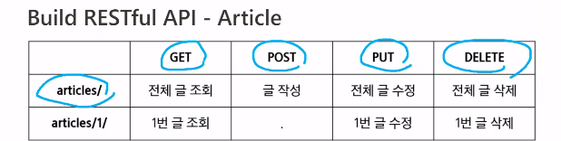
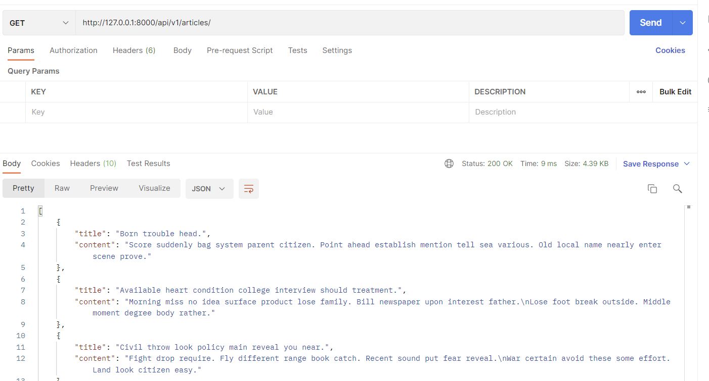
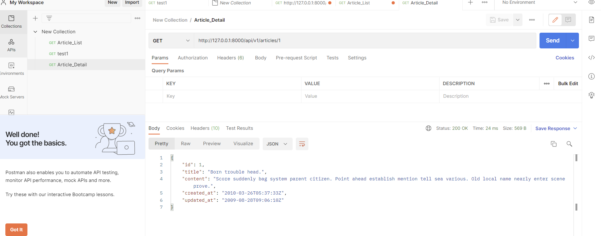
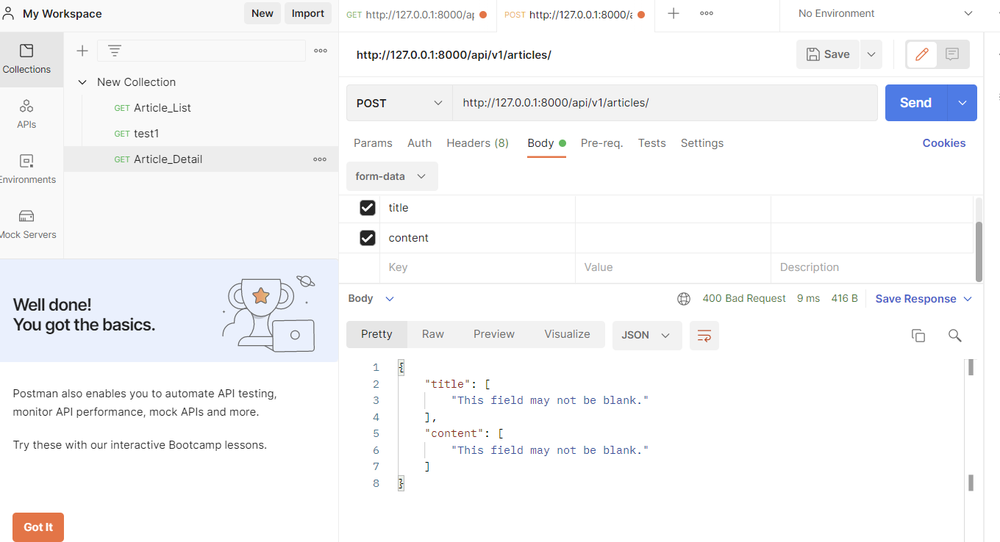
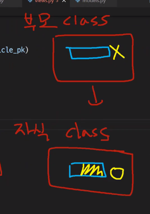
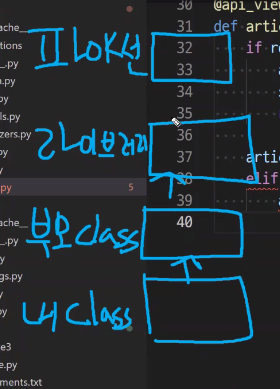
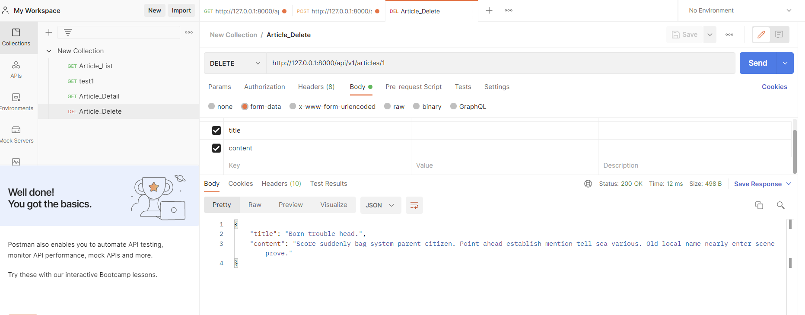

# 0421 TIL django api

$ python -m venv venv

$ source venv/Scripts/activate

$ pip install django django-seed djangorestframework django-extensions ipython

$ pip freeze > requirements.txt

$ django-admin startproject my_api .

$ python manage.py startapp articles


settings.py

```python
INSTALLED_APPS = [
    'articles',
    'django_seed',
    'django-extensions',
    'rest_framework',
    'django.contrib.admin',
    'django.contrib.auth',
    'django.contrib.contenttypes',
    'django.contrib.sessions',
    'django.contrib.messages',
    'django.contrib.staticfiles',
]
```


my_api/urls.py

```python
from django.contrib import admin
from django.urls import path, include

urlpatterns = [
    path('admin/', admin.site.urls),
    path('api/v1/', include('articles.urls')),
]
```


app_name 사용 이유가 redirect인데, 이거는 html보여주지 않고 data만 보여주기 때문에, 쓸 일이 없음

```python
from django.urls import path
from . import views

urlpatterns = [
    
]
```


articles/models.py

```python
from django.urls import path
from . import views

urlpatterns = [
]

```


articles/models.py

```python
from django.db import models

# Create your models here.
class Article(models.Model):
    title = models.CharField(max_length=100) # CharField 최대 길이 필수
    content = models.TextField()
    created_at = models.DateTimeField(auto_now_add=True)    # create니까 add가 붙음
    updated_at = models.DateTimeField(auto_now=True)
```


articles/serializers.py

```python
# articles/serializers.py

from rest_framework import serializers
from .models import Article

class ArticleListSerializer(serializers.ModelSerializer):
    
    class Meta:
        model = Article
        fields = '__all__'
```


urls.py

```python
from django.urls import path
from . import views

urlpatterns = [
    path('json-3/', views.article_json_3),
]
```


views.py

```python
from django.shortcuts import render
from .models import Article
from .serializers import ArticleListSerializer
from rest_framework.response import Response
from rest_framework.decorators import api_view  
# Create your views here.

@api_view(['GET']) # get방식으로만 응답하도록 처리
def article_json_3(request):
    articles = Article.objects.all()
    serializers = ArticleListSerializer(articles, many=True)
    return Response(serializers.data)
```


runserver

POSTMAN


사용자에게 보여줄 필드 수정하려면 serializers.py에서 필드 수정

```python
# articles/serializers.py

from rest_framework import serializers
from .models import Article

class ArticleListSerializer(serializers.ModelSerializer):
    
    class Meta:
        model = Article
        fields = ('title', 'content',)
```


serializers 쓰면 db에서 바꿔주네

---

[추가 참고사항]

python manage.py shell_plus

- ArticleListSerializer 불러오기

In [1]: from articles.serializers import ArticleListSerializer        

In [2]: serializer = ArticleListSerializer()	

(아티클리스트시리얼라이저를 인스턴스화)

In [3]: serializer
Out[3]: 
ArticleListSerializer():
    title = CharField(max_length=100)
    content = CharField(style={'base_template': 'textarea.html'})  

- 하나의 데이터를 불러와서(1번게시글) 직렬화 하기

In [4]: article = Article.objects.get(pk=1)

In [5]: article
Out[5]: <Article: Article object (1)>

In [6]: serializer = ArticleListSerializer(article)	# 재료(article)을 넣어서 도장찍기

In [7]: serializer
Out[7]: 
ArticleListSerializer(<Article: Article object (1)>):
    title = CharField(max_length=100)
    content = CharField(style={'base_template': 'textarea.html'}) 

In [8]: serializer.data
Out[8]: {'title': 'Born trouble head.', 'content': 'Score suddenly bag system parent citizen. Point ahead establish mention tell sea various. Old local name nearly enter scene prove.'}

- 여러 개의 데이터를 직렬화하기 (오류 방지하려면 옵션 줘야함(매니트루))

In [9]: articles = Article.objects.all()

In [10]: serializer = ArticleListSerializer(articles, many=True)  # 여러 개 직렬화 시 many=True 옵션 필수

In [14]: serializer
Out[14]: 
ArticleListSerializer(<QuerySet [<Article: Article object (1)>, <Article: Article object (2)>, <Article: Article object (3)>, <Article: Article object (4)>, <Article: Article object (5)>, <Article: Article object (6)>, <Article: Article object (7)>, <Article: Article object (8)>, <Article: Article object (9)>, <Article: Article object (10)>, <Article: Article object (11)>, <Article: Article object (12)>, <Article: Article object (13)>, <Article: Article object (14)>, <Article: Article object (15)>, <Article: Article object (16)>, <Article: Article object (17)>, <Article: Article object (18)>, <Article: Article object (19)>, <Article: Article object (20)>]>, many=True):
    title = CharField(max_length=100)
    content = CharField(style={'base_template': 'textarea.html'})     

In [15]: serializer.data
Out[15]: [OrderedDict([('title', 'Born trouble head.'), ('content', 'Score suddenly bag system parent citizen. Point ahead establish mention tell sea various. Old local name nearly enter scene prove.')]), OrderedDict([('title', 'Available heart condition college interview should treatment.'), ('content', 'Morning miss no idea surface product lose family. Bill newspaper upon interest father.\nLose foot break outside. Middle moment degree body rather.')]), OrderedDict([('title', 'Civil throw look policy main reveal you near.'), ('content', 'Fight drop require. Fly different range book catch. Recent sound put fear reveal.\nWar certain avoid these some effort. Land look citizen easy.')]), OrderedDict([('title', 'Something tonight interview old six as attack.'), ('content', 'Who possible mother will ground group need. Offer give certain response. Science stay attack official that kind happen. Officer rather send become wife us.')]), OrderedDict([('title', 'Can whether create need blue increase share.'), ('content', 'Against face reveal job.\nSouth understand price sell. Add operation case actually defense.')]), OrderedDict([('title', 'Fast case nice sign.'), ('content', 'Toward TV technology tough democratic need everything mother.\nTown study of treat child exactly exactly. Shoulder investment which financial.')]), OrderedDict([('title', 'Go wife half central though policy student.'), ('content', 'Film try give risk suggest hot. Social travel particular human marriage. Ground along name nice air year add age.')]), OrderedDict([('title', 'Still executive body three.'), ('content', 'Vote blood week subject apply. Force thank dream population.\nBoy identify country two top. Theory story Mr resource.')]), OrderedDict([('title', 'Something store issue six growth him black.'), ('content', 'Already open environment. Sort boy think throughout. Economy against heart.\nOpen station trip guess shoulder. Later produce whom stuff pass decade.\nOr along wall. Go sound usually use.')]), OrderedDict([('title', 'Base wonder generation less blue.'), ('content', 'Draw explain arrive always show shoulder coach front. Drug resource way raise end training.')]), OrderedDict([('title', 'Assume idea surface under arm popular.'), ('content', 'Individual serious indicate themselves check fast. Bad vote community they.')]), OrderedDict([('title', 'Long make early seat whatever represent.'), ('content', 'Within feel marriage girl plan later baby.\nCommon some most production. Nor away exist official model although learn. Quickly item scene few continue.')]), OrderedDict([('title', 'Training company table.'), ('content', 'Its civil base international city recently food sort. Court open nearly.\nTask someone sell major hospital area player. Say just involve. Small since every ok have take.')]), OrderedDict([('title', 'News PM family own worry claim.'), ('content', 'Lose class guy despite people treat. Energy particularly risk party keep different. Trouble already seat glass.\nStandard and walk safe.')]), OrderedDict([('title', 'Three set over song teacher allow tree.'), ('content', 'Positive apply Mr relationship born. Until including option stay speak body.\nPerhaps few capital nice. Wrong worker western maybe say heart enough.')]), OrderedDict([('title', 'Four bad when character.'), ('content', 'Occur wrong manage. Nation view mention. Finish side put.\nPick face deep above follow push responsibility. Peace case development during do possible. Its ready shoulder than work safe research try.')]), OrderedDict([('title', 'Sometimes per live history keep affect.'), ('content', 'Bar recognize just whether forward. Whatever bag owner baby material response detail.\nDuring it production anyone woman young matter. Parent finish through. Easy student south.')]), OrderedDict([('title', 'Dinner central family this artist here pass.'), ('content', 'Assume marriage exist practice seat. Data seat then investment.\nEat audience clearly involve order argue attack. Home role modern special test well throughout. Require environment everyone.')]), OrderedDict([('title', 'Heavy hold book black carry.'), ('content', 'Detail population physical worry area. Major stage star about single impact. Political keep process.\nType like behind painting ago fill bill. Network better consumer son continue evening walk.')]), OrderedDict([('title', 'Chance red conference pay this boy act.'), ('content', 'Store door condition cause resource in. Teacher I either thought order. Its customer state live arm paper everybody third.\nHimself skin wife member simply each. Growth camera several.')])]

---

### RESTful



articles/create : not RESTful

articles : RESTful (뒤에 create, update 등 붙이지 않고 if문으로 나누는것이 restful 왜냐면, 나중에 url이 많아지면 복잡해짐)

- 장점 : 생각 없이 articles 조회, 생성, 수정 등 하고 싶을 때, articles에다가 그냥 put으로 보내면됨
- restful 하지 않은 서버의 문제 : 어디는 articles/update로 해놓고, 어디는 articles/modify로 해놨다 치거나, articles/new, articles/create 로 해놓으면 사람마다 다르게 됨. 이게 싫으니까 이 아저씨가 RESTful하게 만든 것임. 걍 붙이지 말고articles에서 POST로 보내면 어쨌거나 만드는 거야. 수정하고 싶으면 PUT으로 보내.


---


## 본격

```python
from django.urls import path
from . import views

# no app_name
# no name (redirect 사용 X)
urlpatterns = [
    path('json-3/', views.article_json_3),  # serializer를 알아보기 위한 test
    path('articles/', views.article_list),  # 본격적
]
```

views.py 추가

```python
from django.shortcuts import get_list_or_404, render

@api_view(['GET'])  # GET으로만 받아서 응답도 GET으로 보낼 거다
def article_list(request): # 4xx:니탓 # 5xx:미안
    articles = get_list_or_404(Article)
    serializer = ArticleListSerializer(articles, many=True)
    return Response(serializer.data)
```


postman




articles/serializer.py 추가

```python
class ArticleSerializer(serializers.ModelSerializer):
    
    class Meta:
        model = Article
        fields = '__all__'
```


articles/urls.py

```python
from django.urls import path
from . import views

# no app_name
# no name (redirect 사용 X)
urlpatterns = [
    path('json-3/', views.article_json_3),  # serializer를 알아보기 위한 test
    path('articles/', views.article_list),  # 본격적
    path('articles/<int:article_pk>/', views.article_detail),
]
```


articles/views.py 추가

```python
from .serializers import ArticleListSerializer, ArticleSerializer

@api_view(['GET'])
def article_detail(request, article_pk):
    article = get_object_or_404(Article, pk=article_pk)
    serializer = ArticleSerializer(article)
    return Response(serializer.data)
```




---

### Create

views.py 수정

```python
from rest_framework import status

@api_view(['GET', 'POST'])  # GET으로만 받아서 응답도 GET으로 보낼 거다
def article_list(request): # 4xx:니탓 # 5xx:미안
    if request.method == 'GET':
        articles = get_list_or_404(Article)
        serializer = ArticleListSerializer(articles, many=True)
        return Response(serializer.data)
    
    elif request.method == 'POST':
        serializer = ArticleSerializer(data=request.data)
        # if serializer.is_valid():
        if serializer.is_valid(raise_exception=True):
            serializer.save()
            return Response(serializer.data, status=status.HTTP_201_CREATED)
        # return Response(serializer.errors, status=status.HTTP_400_BAD_REQUEST -> is_valid(raise_exception=True) 대체 가능
```



---

### Delete

[참고]

MRO Method Rwsolution Order


- 사춘기여중생이론
  - if문 안에보고 없으면
  - if문 밖에 보고 없으면
  - 파일 전체 보고 없으면
  - 폴더 전체 보고 없으면 끗




- 내 클래스( 내방 뒤지고)
- 부모 클래스 (부모 뒤지고 없으면)
- 라이브러리 (뒤지고 없으면)
- 파이썬
- 발견되면 내 클래스에서 사용함 (하나씩 찾는 걸 MRO라고 함)
- 


views.py 수정

```python
@api_view(['GET','DELETE'])
def article_detail(request, article_pk):
    article = get_object_or_404(Article, pk=article_pk)
    
    if request.method == 'GET':
        serializer = ArticleSerializer(article)
        return Response(serializer.data)
    
    elif request.method == 'DELETE':
        article.delete()
        data = {
            'delete' : f'데이터 {article_pk}번이 삭제되었습니다.'
        }
        return Response(data, status=status.HTTP_204_NO_CONTENT)
```





---

### update - put

views.py

```python
@api_view(['GET','DELETE', 'PUT'])  # update = put
def article_detail(request, article_pk):
    article = get_object_or_404(Article, pk=article_pk)
    
    if request.method == 'GET':
        serializer = ArticleSerializer(article)
        return Response(serializer.data)
    
    elif request.method == 'DELETE':
        article.delete()
        data = {
            'delete' : f'데이터 {article_pk}번이 삭제되었습니다.'
        }
        return Response(data, status=status.HTTP_204_NO_CONTENT)
    
    elif request.method == 'PUT':
        # serializer = ArticleSerializer(instance=article, data=request.data)
        serializer = ArticleSerializer(article, data=request.data)  # 사실 instance가 생략된 상태임(위처럼)
        if serializer.is_valid(raise_exception=True):
            serializer.save()
            return Response(serializer.data)
```


---

ArticleListSerializer(여러 개), ArticleSerializer(한 개) 두 가지 만든 이유

```python
# articles/serializers.py

from rest_framework import serializers
from .models import Article

class ArticleListSerializer(serializers.ModelSerializer):   # 여러 개 용도
    
    class Meta:
        model = Article
        fields = ('title', 'content',)
        
class ArticleSerializer(serializers.ModelSerializer):       # 한 개 용도
    
    class Meta:
        model = Article
        fields = '__all__'
```


---

# 1:N comment

models.py 수정

```python
from django.db import models

# Create your models here.
class Article(models.Model):
    title = models.CharField(max_length=100) # CharField 최대 길이 필수
    content = models.TextField()
    created_at = models.DateTimeField(auto_now_add=True)    # create니까 add가 붙음
    updated_at = models.DateTimeField(auto_now=True)
    
# article 1개 (PK) -> comment N개 (FK)
class Comment(models.Model):
    article = models.ForeignKey(Article, on_delete=models.CASCADE)
    content = models.TextField()
    created_at = models.DateTimeField(auto_now_add=True)
```

models.py가 변경되었으니 migration 진행 => migration 전, 데이터 초기화 위해 db.sqlite3 삭제

```bash
$ python manage.py makemigrations
$ python manage.py migrate
$ python manage.py seed articles --number=20
```

serializers.py

```python
# Comments/serializers.py

from rest_framework import serializers
from .models import Article, Comment

class ArticleListSerializer(serializers.ModelSerializer):   # 여러 개 용도
    
    class Meta:
        model = Article
        fields = ('id', 'title', 'content',)
        
class ArticleSerializer(serializers.ModelSerializer):       # 한 개 용도
    
    class Meta:
        model = Article
        fields = '__all__'
        
class CommentSerializer(serializers.ModelSerializer):       # 한 개 용도
    
    class Meta:
        model = Comment
        fields = '__all__'
        read_only_fields = ('articles',)
```


urls.py

```
```


여기 마저 작성할 것 숙제부분

---

article을 봤을 때 안의 댓글도 같이 나오게 하는 방법

# Nested relationships

for 문 안에 for문이 있듯,

article 괄호 안에 comment 괄호가 있음 (중첩 = nested)

```python
# Comments/serializers.py

from rest_framework import serializers
from .models import Article, Comment

class ArticleListSerializer(serializers.ModelSerializer):   # 여러 개 용도
    
    class Meta:
        model = Article
        fields = ('id', 'title', 'content',)
        
class ArticleSerializer(serializers.ModelSerializer):       # 한 개 용도
    comment_set = serializers.PrimaryKeyRelatedField(many=True, read_only=True)    # Article한개 입장에서 comment를 바라봄
    class Meta:
        model = Article
        fields = '__all__'
        
class CommentSerializer(serializers.ModelSerializer):       # 한 개 용도
    
    class Meta:
        model = Comment
        fields = '__all__'
        read_only_fields = ('article',)    # 쉼표 안 넣으면 문자열로 인식
```


- PrimaryKeyRelatedField

- read_only=True와 read_only_fields의 차이점: 나중에


