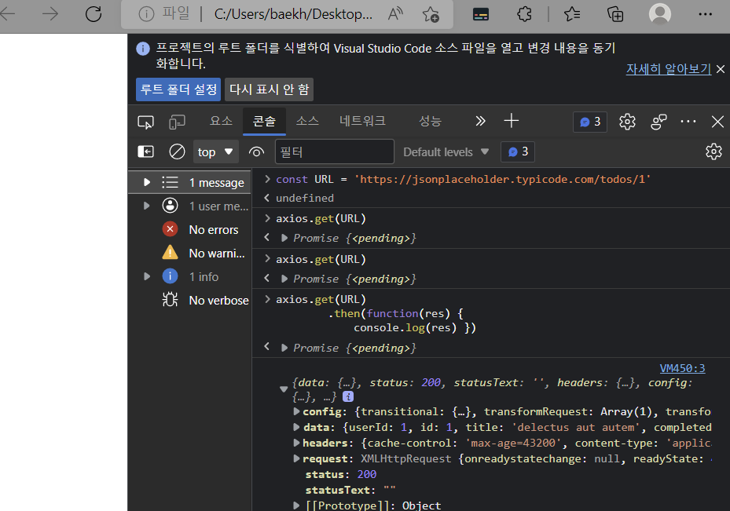

# 0502 JavaScript 03 

## 목차

- AJAX
- Asynchronous JavaScript
  - callback Function
  - Promise
  - Axios


## AJAX

#### Asynchronous JS And XML (비동기식 JS와 XML)

서버와의 통신을 위해 XMLHttpRequest 객체를 활용

JSON, XML, HTML 그리고 일반 텍스트 형식 등을 포함한 다양한 포맷을 주고받을 수 있음

- AJAX의 X가 XML을 의미하긴 하는데, 요즘은 더 가벼운 용량, JS 일부라는 장점을 JSON을 더 많이 사용함


#### 특징

- 페이지 전체를 새로고침 안해도 수행되는 "비동기성"
  - 페이지 새로고침 없이 서버요청
  - 서버로붵 데이터를 받고 작업을 수행


#### AJAX 배경

- 2005 구글맵, 지메일 등에 활용되는 기술을 설명하기 위해 최초로 사용된 용어
- 특정 기술이 아닌, 기존 여러 기술을 사용하는 새로운 접근법을 설명
- 구글의 사용 예
  - Gmail : 메일 전송 요청이 모두 처리되기 전 다른 페이지로 넘어가도 메일은 전송됨
  - Google Maps : 스크롤 행위 하나하나가 모두 요청이지만 페이지는 갱신되지 않음


### XMLHttpRequest 객체

- 서버와 상호작용하기 위해 사용됨, 전체 페이지 새로고침 없이 데이터를 받아올 수 있ㅇ므
- 사용자 작업을 방해하지 않으면서 페이지 일부를 업데이트
- 주로 AJAX 프로그래밍에 사용
- 이름과 다르게 XML 말고도 모든 종류의 데이터를 받아올 수 있음
- 생성자 : `XMLHttpRequest()`


## Asynchronous JavaScript


### 동기식

- 순차적, 직렬적 task 수행
- 요청을 보낸 후에 응답을 받아야 다음 동작이 이루어짐
- 버튼 클릭 후 alert 확인 버튼을 누를 때까지 문장이 만들어지지 않음
- 자스는 single threaded


### 비동기식

- 병렬적 task 수행
- 요청 보낸 후 응답 기다리지 않고 다음 동작 (non-blocking)


- request.send() - 비동기 - 요청 보내고 응답이 올 때까지 기다리지 않음.
- 따라서 그 밑줄들이 동시 실행되면 안됨.


## 비동기를 사용하는 이유

#### "사용자 경험"

- 매우 큰 데이터를 쓰는 앱이 있을 때,
- 동기식 코드
  - 데이터를 모두 불러온 뒤 앱 실행됨
  - 데이터를 불러올때까지는 멈춘것처럼 보임
- 비동기식 코드
  - 응답받을 때까지 앱실행 함께 진행
  - 데이터 불러오는 동안 지속 응답 화면 보여줘서 쾌적한 사용자 경험


### Thread

- 프로그램이 작업을 완료하기 위해 사용할 수 있는 단일 프로세스
- 각 스레드는 한 번에 하나의 작업만 수행 가능
- task A => task B=> task C
  - 컴터 CPU는 여러 코어를 가지고 있어서 한 번에 여러 일 처리 가능
  - 엥? 브라우저 탭 하나 당 3개 일을 배정 받는다면? 이게 코드 짜기 어렵다고 함.


## JavaScript는 single threaded 이다.

- 컴퓨터가 여러 CPU를 가지고 있어도 main thread 라 불리는 단일 스레드에서만 작업 수행
- 이벤트를  처리하는 call stack이 하나인 언어
- 이 문제 해결을 위해 JS는
  1. 즉시 처리하지 못하는 이벤트들을 다른 곳(Web API)로 보내서 처리하게 하고,
  2. 처리된 이벤트들은 처리된 순서대로 대기실(Task queue)에 줄을 세워 놓고
  3. Call Stack이 비면 담당자(Event Loop)가 대기 줄에서 가장 오래된(제일 앞의)이벤트를 Call Stack으로 보냄


### Currency model

event loop 을 기반으로 하는 동시성 모델

1. Cal Stack
   - 요청이 들어올 때마다 해당 요청을 순차처리하는 스택형태 자료구조(LIFO)
2. Web API (Browser API)
   - JS 엔진이 아닌 브라우저 영역에서 제공하는 API
   - setTimeout(), DOM events 그리고 AJAX로 데이터를 가져오는 시간이 소요돼ㅣ는 일
   - AJAX, 시간관련 - web API => 비동기 동작 (언제 끝날지 모르는 업무)
3. Task Queue (event, message)
   - 비동기 처리된 콜백함수가 대기하는 큐 형태의 자료구조
   - main thread가 끝난 후 실행되어 후속 JS 코드가 차단되는 것을 방지
4. Event Loop
   - call stack이 비어있는지 확인
   - 비어있으면 task queue에서 실행대기중인 callback 함수가 있는지 확인
   - 있다면 가장 앞에 있는 콜백함수를 


```javascript
console.log('hi') // 1번

setTimeout(function hh () {
    console.log('3seconds')
}, 3000)						// 2번

console.log('bye')				// 3번
```

1. call stack에 1번 코드인 console.log('ji')가 맨 밑에 쌓임 output 'hi' 하고 call stack 비워짐
2. call stack 에 2번 들어오는데, 시간관련이라 언제끝날지 모르니까 web API로 보냄
3. call stack 에 3번 들어와서 'bye' output
4. web API에 있던 함수 3초가 지나서 task queue에 들어옴.
5. event loop가 잠깐 멈춰! 시전함. - call stack 비워져있네? OK 실행되고 ouput '3seconds'


### 왜 이럴까?

3초 세는 것을 본인이 했다면,  JS 브라우저에서는 아무것도 못해서 3초 동안 뻗어버림. 그래서 시간 관련 일은 전부 web api로 보내버리기로 함. 그리고 web api로부터 나온 애들은 다시 call stack으로 바로 돌아가지 않고, 콜백함수가 task queue에 순차적으로 쌓임


web api에 갔다오는 애들은 바로 가는 애들보다 무조건 우선순위 낮음


## Zero delays


## 순차적 비동기 처리

- web api로 들어오는 순서는 중요하지 않고, 어떤 이벤트가 먼저 처리되느냐가 중요
- 이를 해결하기 위한 순차적 비동기 처리를 위한 2가지 작성 방식
  1. Async callbacks
     - 백크라운드에서 실행시작할 함수 호출 시 인자로 지정된 함수
       - addEventListener()의 두 번째 인자
  2. Promise-style
     - Modern Web APIs에서의 새로운 코드 스타일
     - XMLHttpRequest 객체를 사용하는 구조보다 현대적인 버전


---


### callback function

- 다른 함수에 인자로 전달된 함수
- 외부 함수 내에서 호출되어 작업을 완료(루틴을)
- 동기식, 비동기식 모두 사용됨 (but, 비동기 작업 후 코드 실행 계속하는 데 주로 사용)
- 비동기 작업 후 코드 실행을 계속하는 데 사용되는경우 : 비동기 콜백 (asynchronous callback)


###  일급 객체 (first class object)

- 일급 객체 (일급 함수)

  - 다른 객체들에 적용할 수 있는 연산을 모두 지원하는 객체

- 조건

  1. 인자로 넘기기 가능
  2. 함수의 반환값으로 사용 가능
  3. 변수에 할당 가능

  ```javascript
  const a = function () {} // 1조건
  
  a // f () {}
  
  function asdf (x) {
      return x
  }
  asdf(a) // f () {}
  ```


### Async callbacks

- 백그라운드에서 코드 실행을 시작할


### callback hell


- 해결하기

1. Keep your code shallow (코드 깊이를 얕게 유지)
2. Modularize (모듈화)
3. Handle every single error (모든 단일 오류 처리)
4. Prommise callvacks (promise 콜백 방식 사용)


## Promise


### Promise object

약속하는거. 뭐 할건데 성공하면 뭐할거고 실패하면 뭐할거야 (방학계획표 ^^)

- 비동기 작업의 최종완료 or 실패를 나타내는 객체
  - 미래의 완료 or 실패와 그 결과값을 나타냄
- 성공(이행)에 대한 약속 : `.then()`
- 실패(거절)에 대한 약속 : `.catch()`


- .then (callback)
  - 이전작업이 성공했을 때 수행할 작업을 나타내는 콜백함수
  - 그리고 각 콜백함수는 이전 작업의 성공 결과를 인자로 전달받음
  - 따라서 성공했을 때의 코드를 콜백함수 안에 작성
- .catch(callback)
  - .then이 하나라도 실패하면(거부되면) 동작 (동기식의 try-except구문과 유사)
  - 이전 작업 실패로 생성된 error 객체는 catch 블록 안에서 사용 가능


### Promise가 보장하는 것

- Async callback 작성 스타일과 다르게 promise가 보장하는 특징
  1. callback 함수는 JS의 Event Loop가 현재 실행중인 Call Stack을 완료하기 전에는 절대 호출되지 않음 (프로미스 콜백함수는 이벤트 큐에 배치되는 엄격한 순서로 호출됨)
  2. 비동기 작업이 성공하거나 실패한 뒤에 `.then()`메서드를 이용하여 추가한 경우에도 1번과 똑같이 동작
  3. .then()을 여러 번 사용하여 여러 개의 callback 함수 추가 가능(Chaining)
     - 각각의 콜백은 주어진 순서대로 하나하나 실행
     - Chaining은 promise의 가장 뛰어난 장점


### Axios

- ''Promise based HTTP client for the browser and Node.js"

- 브라우저를 위한 프로미스 기반 클라이언트

- 원래 "XHR(XMLHttpRequest)"이라는 브라우저 내장 객체를 활용해 AJAX 요청을 처리하는데,

- 이보다 편리한 AJAX 요청이 가능하도록 도움을 줌


이 과정에서 새로고침이 나지 않음.


Axios를 쓴 것과 안 쓴 것의 차이


---


jsonplaceholder





---


axios vscode

---


### async & await

- 비동기 코드를 작성하는 새로운 방법
- 기존 Promise 시스템 위에 구축된 syntactic sugar
  - Promise 구조의 then chaining을 제거
  - 비동기 코드를 조금 더 동기 코드처럼 표현
  - Syntactic sugar
    - 더 쉽게 읽고 표현할 수 있도록 설계된 프로그래밍 언어 내 구문
    - 즉, 문법적 기능은 그대로 유지 BUT 사용자가 직관적으로 코드를 읽을 수 있게 만듦


AJAX 핵심은 끊기지 않고 물 흐르듯이
