가상환경설치,

python migrate

python manage.py seed articles --number 20

runserver

회원가입

가장 밑글 좋아요 누르면 위로 새로고침됨

검사, 네트워크하면

300대는 리다이렉트인데, 아티클을 불러오는 데 시간이 오래걸림

index.html의 form에서 redirect하지 않고 JS로 보내도록 할거임

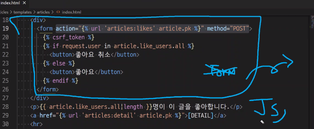

따라서, 다 지워줌

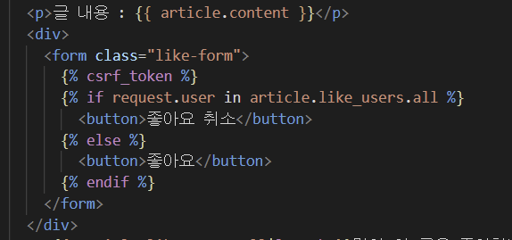

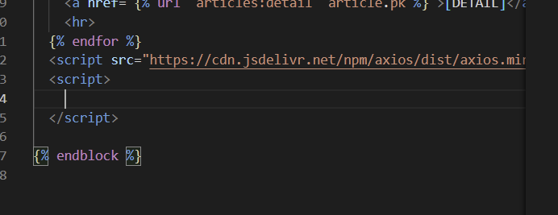

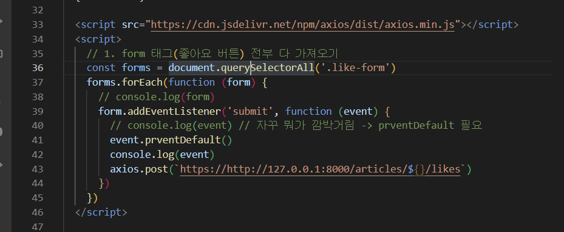

교수님

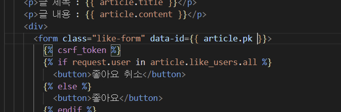

---

csrf token

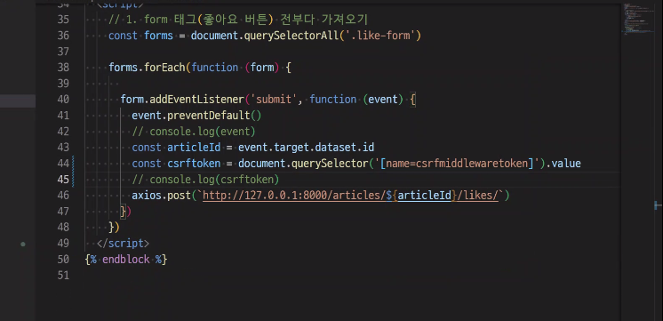

---

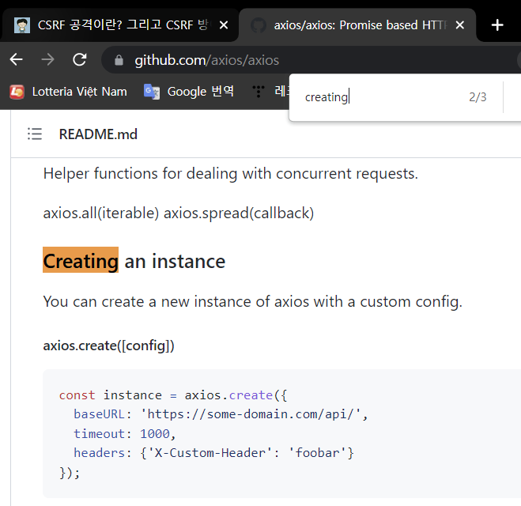

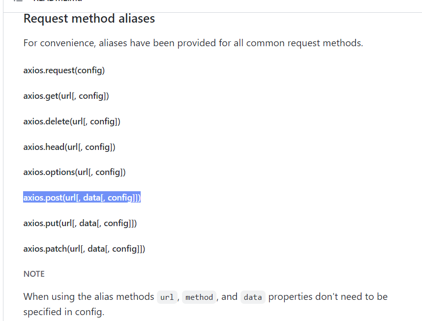

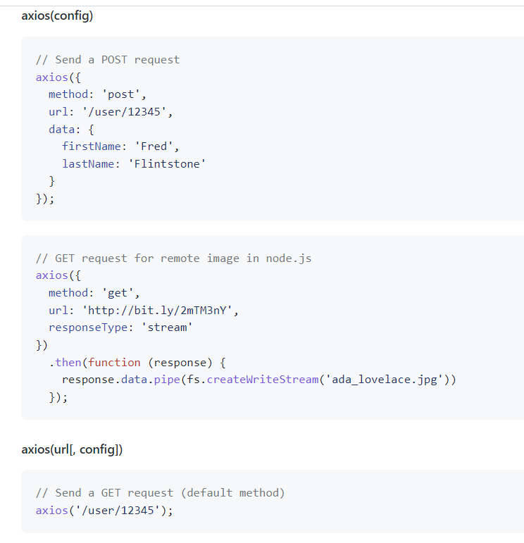

https://docs.djangoproject.com/en/4.0/ref/csrf/

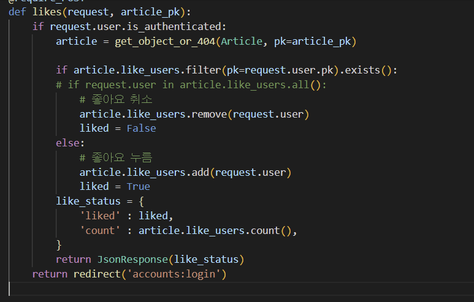

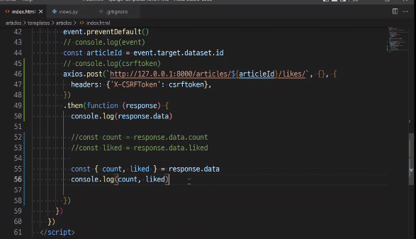

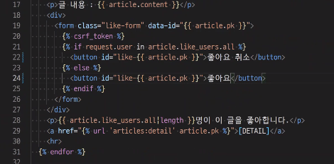

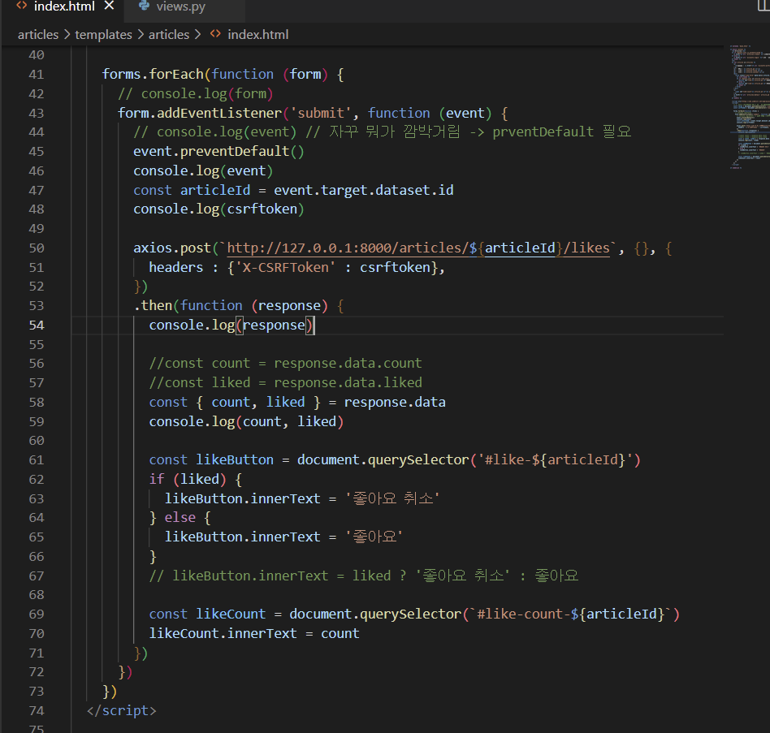

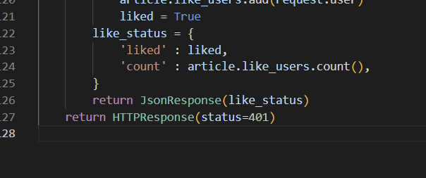