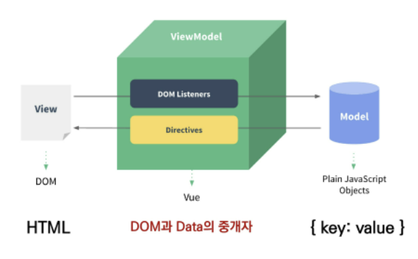
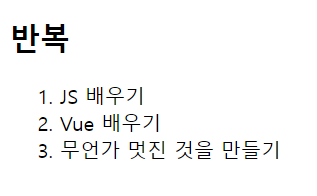
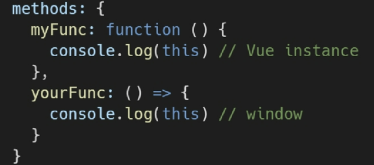
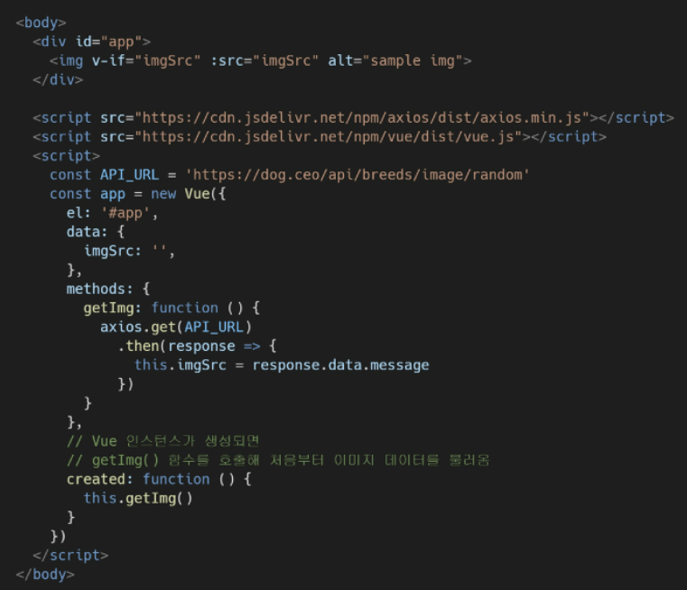

# 0505 TIL Vue.js


## 개요

1. Vue.js

   - 사용자 인터페이스를 만들기 위한 진보적 JS 프레임워크
   - 현대적인 툴과 다양한 라이브러리로 Single Page App를 완벽 지원

2. 발표자: Evan You (2014)

   - 구글 Angular 개발자 출신
   - 학사 미술, 미술사 전공 + 석사 디자인 & 테크놀로지
   - 구글 앵귤러보다 가볍고 간편하게 사용 가능한 프레임워크 개발

3. SPA (Single Page Application)

   - 단일 페이지 애플리케이션
   - 현재 페이지를 동적으로 렌더링하여 사용자와 소통하는 앱 어플

   - 단일 페이지 구성, 서버로부터 최초에만 페이지를 다운로드, 이후 동적 DOM 구성
     - DOM : Document Object Model : 문서 객체 모델
     - 처음 페이지를 받은 이후부터는 서버로부터 새로운 전체페이지를 불러오지 않고 현재 페이지 중에서 필요한 부분만 동적으로 재작성
   - 연속되는 페이지 간 사용자 경험(UX) 향상
     - 모바일 사용량이 증가하는 요즘, 트래픽 감소, 속도, 사용성, 반응성 향상의 중요성 증대
   - 동작원리 일부가 CSR (Client Side REndering)의 구조를 따름

4. SPA 등장 배경

   - 과거 웹사이트들은 요청에 따라 매번 새로운 페이지를 응답하는 방식 (MPA(Multi Page App))
   - 스마트폰의 등장으로 모바일 최적화 필요성 대두
     - 모바일 네이티브 앱과 같은 웹 페이지 필요해짐
   - 문제 해결을 위해 Vue.js같은 프론트엔드 프레임워크 등장
     - CSR, SPA의 등장
   - 1개 웹페이지에서 여러 동작이 이루어지며 모바일 앱과 비슷한 형태의 사용자 경험 제공

5. CSR (Client Side Rendering)

   - 서버에서 화면을 구성하는 SSR 방식과 다르게 클라이언트에서 화면을 구성
   - 최초 요청 시 HTML, CSS, JS 등 데이터를 제외한 각종 리소스를 응답받고 이후 클라이언트에서 필요 데이터만 요청하여 JS로 DOM을 렌더링하는 방식
   - 즉, 첫 뼈대만 받고 브라우저에서 동적으로 DOM을 그림
   - SPA가 사용하는 렌더링 방식

6. CSR 장점

   - 서버와 클라이언트 간 트래픽 감소
     - web app에 필요한 모든 정적 리소스를 최초 한 번 다운로드 후 필요 데이터만 갱신
   - 사용자 경험 향상
     - 전체 페이지를 재 렌더링하지 않고 변경되는 부분만 갱신하므로

7. CSR 단점

   - SSR에 비해 전체 페이지 최종 렌더링 시점이 느림
   - SEO(검색 엔진 최적화)에 어려움이 있음 (최초 문서에 데이터 마크업이 없기 때문)

8. SSR (Server Side Rendering)

   - 서버에서 클라이언트에게 보여줄 페이지를 모두 구성하여 전달
   - JS 웹 프레임워크 이전에 사용되던 전통적 렌더링 방식

9. SSR 장점

   - 빠른 초기 구동 속도 (클라이언트가 빠르게 컨텐츠 볼 수 있음)
   - SEO(검색 엔진 최적화)에 적합
     - DOM에 이미 모든 데이터가 작성되어있으므로

10. SSR 단점

    - 모든 요청마다 새 페이지를 구성하여 전달함
      - 반복되는 전체 새로고침 => UX 하락
      - 상대적으로 많은 트래픽 => 서버 부담

11. SSR vs CSR

    - 두 방식의 차이는 최종 HTML 생성 주체가 누구인지에 따라 결정됨
    - 실제 브라우저에 그려질(렌더링) HTML을
      - 서버가 만든다 = SSR
      - 클라이언트가 만든다 = CSR
    - 어떤 게 더 좋다라는 게 아님. 내 서비스나 프젝 구성에 맞는 방법을 적절 선택하셈
    - ex) Django에서 Axios로 좋아요/팔로우 로직 구성 시 => SSR
    - ex) 특정요소(좋아요,팔로우)만 JS(AJAX & DOM조작)를 활용 => CSR
      - AJAX를 활용해 비동기 요청으로 필요한 데이터를 클라이언트에서 서버로 직접 요청을 보내 받아오고 js로 dom 조작

12. SEO (Search Engine Optimization) 검색 엔진 최적화

    - 웹 페이지 검색엔진이 자료를 수집하고 순위를 매기는 방식에 맞게 웹 페이지를 구성해서 검색 결과 상위에 노출될 수 있도록 하는 작업
    - 인터넷 **마케팅** 방식 중 하나
    - 구글 등장 후 검색엔진들이 컨텐츠 신뢰도를 파악하는 기초 지표로 사용
      - 다른 웹 사이트에서 얼마나 인용됐는지? 반영하므로 인용 횟수를 늘리는 방향으로 최적화

13. SEO 대응

    - Vue.js 또는 React 등의 SPA 프레임워크는 SSR을 지원하는 SEO 대응 기술이 이미 존재
      - SEO 대응이 필요한 페이지에 대해서는 선별적 SEO 대응 가능
    - 혹은 추가로 별도 프레임워크 사용하기도
      - Nuxt.js - Vue.js 응용 프로그램을 만들기 위한 프레임워크 (SSR 지원)
      - Next.js - React 응용 프로그램을 만들기 위한 프레임워크 (SSR 지원)


## Vue를 사용하는 이유

1. 가장 인기있슴!
2. 현대 웹 페이지 페이지 규모 지속적 증가 => 사용 데이터 및 사용자와의 상호작용 증가
3. Vanilla JS 만으로는 관리가 어려워짐 => 


### 비교

#### Vanilla JS

- 한 유저가 작성한 게시글이 DOM상에 100개 존재
- 이 유저가 닉네임을 변경하면, DB의 updatd와 별도로 DOM 상의 100개의 작성자 이름이 모두 수정돼야 함
- 모든 요소를 선택해서 이벤트를 등록하고 값을 변경해야 함 (불필요 코드의 반복)

#### Vue.js

- DOM과 Data가 연결되어 있고
- Data를 변경하면 이에 연결된 DOM은 알아서 변경
- 즉, 우리가 신경써야 할 것은 오직 data에 대한 관리 (Developer Exp 향상)


## Concepts of Vue.js

1. MVVM Pattern

   - 애플리케이션 로직을 UI로부터 분리하기 위해 설계된 디자인 패턴
   - 구성요소
     - Model
     - View
     - View Model

   

2. MVVM

   - Model
     - Vue에서 **Model**은 **JS 객체**다!
     - Object --- { key: value }
     - Model은 Vue Instance 내부에서 data라는 이름으로 존재
     - 이 data가 바뀌면 View(DOM)가 반응
   - View
     - Vue에서 **View**는 **DOM(HTML)**이다!!
     - data 변화에 따라 바뀌는 대상
   - ViewModel
     - Vue에서 **ViewModel**은 모든 **Vue Instance**이다!!
     - <u>View와 Model 사이</u>에서 data와 DOM에 관련된 모든 일을 처리
     - ViewModel을 활용해 data를 얼만큼 잘 처리해서 보여줄 것인지(DOM)을 고민하는 것


## Vue version 2 vs 3

1. Vue 3
   - 2022.2부터 뷰 프레임워크 기본 버전이 3.X로 전환
   - CDN or npm을 통한 설치시 자동으로 Vue 3로 설정
2. Vue 2
   - 실무에서는 여전히 Vue2가 많이 사용됨 (legacy code)
     - legacy system : 낡은 기술이나 방법론, 컴퓨터 시스템, 소프트웨어 등. 현재까지 남아 사용되고 있거나 현재 체계에 영향을 미치는 과거의 체계
   - Vue 2의 생태계 (문서, 튜토리얼, 자료, QnA 등)가 더 성숙함
   - 코어/커뮤니티 라이브러리의 호환 역시 2가 더 안정적임
   - 참고자료가 많은 Vue2로 학습 후 3으로 이전(migrate)하는 게 가장 효과적~


## Quick Start of Vue.js

1. Django & Vue.js 코드 작성 순서

   - Django

     - 데이터의 흐름
     - url => views => template

   - Vue.js

     - data 변화 시 DOM이 변경

     1. Data 로직 작성
     2. DOM 작성


### 공식문서 "시작하기" 따라하긔

1. CDN 작성

2. 선언적 렌더링

   ```html
   <h2>선언적 렌더링</h2>
   <div id="app">
       {{ message }}
   </div>
   ```

   ```javascript
   var app = new Vue({
       el: '#app',
   	data: {
           message: '안녕 뷰야'
       }
   })
   ```

3. Element 속성 바인딩

   ```html
   <h2>Element 속성 바인딩</h2>
   <div id="app-2">
       <span v-bind:title="message">
       	내 위에 잠시 마우스를 올리면 도적 바인딩 된 title을 볼 수 있어.
       </span>
   </div>
   ```

   ```javascript
   var app2 = new Vue({
       el: '#app-2',
       data: {
           message: "이 페이지는 " + new Date() + " 에 로드 되었습니다"
       }
   })
   ```

4. 조건문

   ```html
   <h2>조건</h2>
   <div id="app-3">
       <p v-if="seen">
           이제 나를 볼 수 있어요
       </p>
   </div>
   ```

   ```javascript
   var app3 = new Vue({
       el: '#app-3',
       data: {
           seen: true // false로 토글 가능
       }
   })
   ```

5. 반복문

   ```html
   <h2>반복</h2>
   <div id="app-4">
       <ol>
           <li v-for="todo in todos">
               {{ todo.text }}
           </li>
       </ol>
   </div>
   ```

   ```javascript
   var app4 = new Vue({
         el: '#app-4',
         data: {
             todos: [
                 { text: 'JS 배우기' },
                 { text: 'Vue 배우기' },
                 { text: '무언가 멋진 것을 만들기' }
             ]
         }
     })
   ```

   

6. 사용자 입력 핸들링

   ```html
   <h2>사용자 입력 핸들링</h2>
   <div id="app-5">
       <p>{{ message }}</p>
       <button v-on:click="reverseMessage">메시지 뒤집기</button>
   </div>
   <!-- VUE -->
   <script src="https://cdn.jsdelivr.net/npm/vue/dist/vue.js"></script>
   <script>
       var app5 = new Vue({
           el: '#app-5',
           data: {
               message: '안녕! 뷰야'
           },
           methods: {
               reverseMessage () {
                   this.message = this.message.split('').reverse().join('')
               }
           }
       })
   ```

   


## Basic Syntax of Vue.js

1. Vue Instance

   - 모든 vue 앱은 vue 함수로 새 인스턴스를 만드는 것부터 시작

     ```script
     const app = new Vue ({
     
     })
     ```

   - vue 인스턴스를 생성할 때는 Options 객체를 전달해야 함

   - 여러 Options들을 사용하여 원하는 동작을 구현

   - Vue Instance === Vue Component

2. Options/DOM - **'el'**

   - Vue 인스턴스에 연결(마운트) 할 기존 DOM 요소가 필요
   - CSS 선택자 문자열 혹은 HTML Element로 작성
   - new를 이용한 인스턴스 생성 때만 사용

3. Options/Data = 'data'

   ```javascript
   const app = new Vue({
       el: '#app',
       data: {
           message: 'Hello'
       }
   })
   ```

   - Vue 인스턴스의 데이터 객체로, 상태 데이터를 정의하는 곳

   - Vue Template에서 interpolation(보간: 두 점을 연결하는 방법)을 통해 접근가능

   - v-bind, v-on과 같은 directive에서도 사용가능

   - Vue 객체 내 다른 함수에서 this 키워드를 통해 접근 가능

4. Options/Data = 'methods'

   - Vue 인스턴스에 추가할 메서드
   - Vue Template에서 interpolation을 통해 접근 가능
   - V-on과 같은 directive에서도 사용가능
   - Vue 객체 내 다른 함수에서 this 키워드를 통해 접근 가능
   - 주의
     - 화살표 함수를 메서드 정의에 사용해서는 안 됨!!
     - 화살표 함수가 부모 컨텍스트를 바인딩하므로, 'this'는 vue 인스턴스가 아님

5. 'this' keyword in Vue.js

   - Vue 함수 객체 내에서 vue 인스턴스를 가리킴
   - BUT 화살표 함수 사용 금지의 경우
     - data
     - method 정의
   - 


## Template Syntax

1. Template Syntax

   - 렌더링 된 DOM을 기본 Vue 인스턴스의 데이터에 선언적으로 바인딩할 수 있는 HTML 기반 템플릿 구문을 사용
     - Interpolation
     - Directive

2. Interpolation (보간법)

   1. Text 

      ```html
      <span>메시지: {{ msg }}</span>
      ```

   2. Raw HTML

      ```html
      <span v-html="rawHtml"></span>
      ```

   3. Attributes

      ```html
      <div v-bind:id="dynamicId"></div>
      ```

   4. JS 표현식

      ```html
      {{ number + 1 }}
      {{ message.split('').reverse().join('') }}
      ```

3. Directive (디렉티브)

   - v- 접두사가 있는 특수 속성

   - 속성 값은 단일 JS 표현식이 됨 (v-for은 예외)

   - 표현식의 값이 변경될 때 반응적으로 DOM에 적용하는 역할을 함

   - 전달인자 (Argument)

     - 콜론(:)을 통해 전달인자를 받을 수도 있음

       ```html
       <a v-bind:href="utl"> ... </a>
       <a v-on:click="doSomething"> ... </a>
       ```

   - 수식어 (Modifiers)

     - 점(.)으로 표시되는 특수 접미사

     - directive를 특별한 방법으로 바인딩 해야 함을 나타냄

       ```html
       <form v-on:submit.prevent="onSubmit"> ... </form>
       ```

4. v-text

   - 엘리먼트의 textContent를 업데이트
   - 내부적으로 interplation 문법이 v-text로 컴파일 됨

5. v-html

   - 엘리먼트의 innerHTML을 업데이터 => XSS 공격에 취약
   - 임의 사용자로부터 입력받은 내용은 v-html에 절대 사용금지

6. v-show

   - 조건부 렌더링 중 하나
   - 요소는 항상 렌더링 되고 DOM에 남아 있음
   - 단순히 엘리먼트에 display CSS 속성을 토글하는 것

7. v-if, v-else-if, v-else

   - 조건부 렌더링 중 하나
   - 조건 따라 요소를 렌더링
   - directive의 표현식이 true일 때만 렌더링
   - 엘리먼트 및 포함된 directive는 토글 중 삭제되고 재작성됨

8. v-show와 v-if

   - v-show
     - CSS display 속성을 hidden 으로 만들어 토글
     - 실제로 렌더링은 되지만 눈에서 보이지 않는 것이므로 딱 한 번만 렌더링 되는 경우라면 if에 비해 상대적으로 렌더링 비용이 높음
     - BUT, 자주 변경되는 요소라면 한 번 렌더링 된 이후부터는 보여주는지에 대한 여부만 판단하면 되기 때문에 토글 비용이 적음
   - v-if
     - 전달 인자가 false인 경우 렌더링 되지 않음
     - 화면에서 보이지 않을 뿐만 아니라 렌덜이 자체가되지 않기 땜시 렌더링 비용이 낮음
     - BUT, 자주 변경되는 요소의 경우 재 렌더링 해야 하므로 비용 증가 가능성

9. v-for

   - 원본 데이터 기반 엘리먼트나 템플릿 블록을 여러 번 렌더링
   - item in items 구문 사용
   - item 위치의 변수를 각 요소에서 사용 가능
     - 객체의 경우는 key
   - v-for 사용 시 반드시 key 속성을 각요소에 작성
   - v-if와 사용하는 경우 v-for가 우선순위가 더 높음 (가능하면 둘이 동시 사용X)

10. v-on

    - 엘리먼트에 이벤트 리스너를 연결
    - 이벤트 유형은 전달인자로 표시함
    - 특정 이벤트 발생 시, 주어진 코드 실행
    - 약어
      - @
      - v-on:click => @click

11. v-bind

    - HTML 요소의 속성에 Vue 상태 데이터를 값으로 할당
    - Object 형태로 사용하면 Value가 true인 key가 Class 바인딩 값으로 할당
      - 바인딩 : 프로그램의 어떤 기본 단위가 가질 수 있는 구성요소의 구체적인 값, 성격을 확정짓는 것 / 프로그램 기본 단위에 해당 기본 단위가 가질 수 있는 속성 중 일부 필요 속성만 선택하여 연결해 주는 것
    - 약어
      - : (콜론)
      - v-bind:href => :href

12. v-model

    - HTML form 요소의 값과 data를 양방향 바인딩
    - 수식어
      - .lazy - input 대신 change 이벤트 이후 동기화
      - .number - 문자열을 숫자로 변경
      - .trim - 입력에 대한 trim을 진행

13. Options/Data = 'computed'

    - 데이터 기반 계산된 속성
    - 함수 형태로 정의 BUT 함수의 반환 값이 바인딩 됨
    - 종속되 데이터에 따라 저장(캐싱) 됨
    - **종속된 데이터가 변경될 때만 함수를 실행**
    - 즉, 어떤 데이터에도 의존하지 않는 computed 속성의 경우 절대로 업데이트되지 않음
    - 반드시 반환 값이 있어야 함

14. Computed vs methods

    - computed 속성 대신 methods에 함수를 정의할 수도 있음
      - 최종 결과에 대해 두 가지 접근 방식은 서로 동일
    - 차이점
      - computed 속성은 종속 대상을 따라 저장됨
        - 종속된 대상이 변경되지 않는 한 computed에 작성된 함수를 여러 번 호출해도 계산을 다시 하지 않고 계산되어 있던 결과 반환
      - methods 호출 시 렌더링을 다시 할 때마다 항상 함수를 실행

15. Options/Data - 'watch'

    - 데이터를 감시(데이터 변화 시 실행되는 함수)

16. computed vs watch

    1. computed
       - 특정 데이터를 직접 사용, 가공하여 다른 값으로 만들 때 사용
       - 속성은 계산해야 하는 목표 데이터를 정의
       - 선언적 프로그래밍
       - **특정 값이 변동하면 해당 값을 다시 계산해서 보여준다.**
    2. watch
       - 특정 데이터 변화 상황에 맞춰 다른 data 등이 바뀌어야 할 때 주로 사용
       - 감시할 데이터를 지정, 그 데이터가 바뀌면 특정함수를 실행
       - 명령형 프로그래밍
       - **특정 값이 변동하면 다른 작업을 한다.**
       - **특정 대산 변경 시 콜백함수를 실행시키기 위한 트리거**

    - 뭐가 더 우수할 건 없고 사용 목적, 상황따라 다름

17. 선언형 vs 명령형

    - 선언형 프로그래밍 : 계산해야 하는 목표 데이터를 정의 (computed)
    - 명령형 프로그래밍 : 데이터가 바뀌면 특정 함수를 실행해! (watch)

18. Options/Assets = 'filter'

    - 텍스트 형식화 적용 필터
    - interpolation 혹은 v-bind를 이용할 떄 사용 가능
    - 필터는 JS 표현식 마지막에 "|" (파이프)와 함께 추가되어야 함
    - 이어서 사용(Chaining ) 가능


## Lifecycle Hooks

1. Lifecycle Hooks

   - 각 Vue 인스턴스는 생성될 때 일련의 초기화 단계를 거침
   - ex)
     - 데이터 관찰 설정 필요 시
     - 인스턴스를 DOM에 마운트하는 경우
     - 데이터 변경되어 DOM을 업데이트 하는 경우
   - 그 과정에서 사용자 정의 로직을 실행할 수 있는 lifecycle Hooks도 호출됨
   - 공식문서를 통해 각 라이프사이클 훅의 상세 동작을 참고

2. 예시

   - created hook은 vue 인스턴스가 생성된 후에 호출 됨

     ```javascript
     new Vue({
         data: {
             a: 1
         },
         created: functions () {
         	console.log('a is ' + this.a) // => 'a is: 1'
     }
     })
     ```

   - created를 사용해 애플리케이션의 초기 데이터를 API 요청을 통해 불러올 수 있음

     

     

     