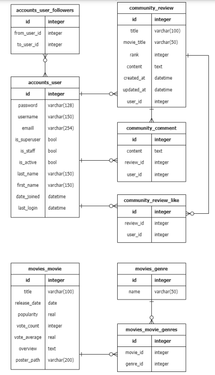
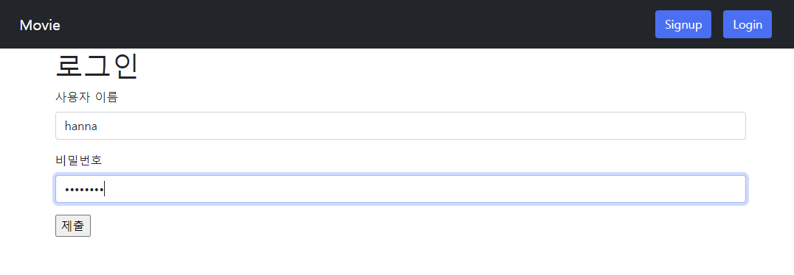
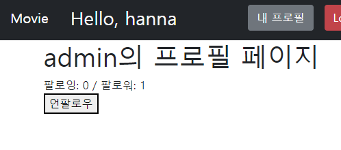
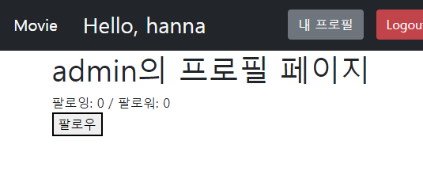
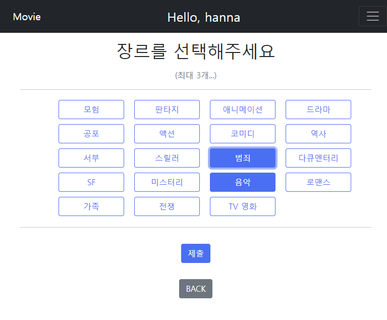
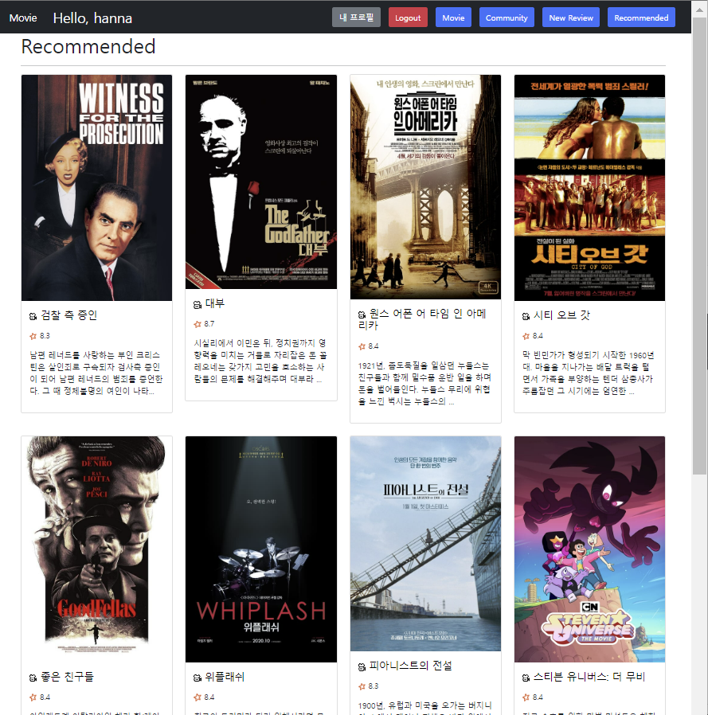

# :film_projector: pjt08

### :goal_net: **목표**

- **데이터 생성, 조회, 삭제, 수정 가능한 Web Application 제작**
- **AJAX 통신과 JSON 구조에 대한 이해**
- **Database 1:N, M:N 관계의 이해, 데이터 관계 설정**
- **영화 추천 알고리즘 설계**


### :record_button: **준비사항**

- **언어**
  - **Python 3.9+**
  - **Django 3.2+**
- **도구**
  - **VSCode**
  - **Chrome Browser**


### :balloon: **요구사항**

- **커뮤니티 서비스의 상세 기능 개발을 위한 단계**

- **비동기 통신 (AJAX)을 활용하여 사용자의 UI/UX를 개선**


### :spiral_notepad: 프로젝트 구조

- pjt09
  - settings.py
  - urls.py
- templates/
  - base.html
- accounts/
  - migrations/
  - templates/
  - forms.py
  - models.py
  - urls.py
  - views.py
  - ...
- community
  - migrations/
  - templates/
  - forms.py
  - models.py
  - urls.py
  - views.py
  - ...
- movies/
  - fixtures/
  - migrations/
  - templates/
  - forms.py
  - models.py
  - urls.py
  - views.py
  - ...
- manage.py
  - ...


### model

**DB 모델의 ERD (Entity Relation Diagram)**




### URL

**app_name과 pattern name을 설정하여 적용**

1. **accounts app**

   accounts app의 모든 URL 패턴은 accounts/로 시작

   | HTTP verb  |      URL 패턴       |                  설명                   |
   | :--------: | :-----------------: | :-------------------------------------: |
   | GET & POST |       signup/       | Form 표시 및 신규 사용자 생성(회원가입) |
   | GET & POST |       login/        |  Form 표시 및 기존 사용자 인증(로그인)  |
   | GET & POST |       logout/       |    인증된 사용자 인증 해제(로그아웃)    |
   |    GET     |    `<username>/`    |         사용자 상세 조회 페이지         |
   |    POST    | `<user_pk>/follow/` |        팔로우 추가/ 팔로우 취소         |

2. **community app**

   community app의 모든 UTL 패턴은 community로 시작

   | HTTP verb  |            URL 패턴             |            설명             |
   | :--------: | :-----------------------------: | :-------------------------: |
   | GET & POST |             create/             | Form 표시 및 신규 리뷰 생성 |
   |    GET     |                /                | 전체 리뷰 목록 조회 페이지  |
   |    GET     |         `<review_pk>`/          | 단일 리뷰 상세 조회 페이지  |
   |    POST    | ``<review_pk>`/comments/create/ |          댓글 생성          |
   |    POST    |      ``<review_pk>`/like/       |         좋아요 기능         |

3. **movies app**

   movies app의 모든 URL 패턴은 movies/로 시작합니다.

   | HTTP verb |   URL 패턴    |            설명            |
   | :-------: | :-----------: | :------------------------: |
   |    GET    |       /       | 전체 영화 목록 조회 페이지 |
   |    GET    | `<movie_pk>`/ | 단일 영화 목록 조회 페이지 |
   |    GET    |  recommended  |   추천 영화 조회 페이지    |

---


### View & Template

#### 1. 유저 팔로우 기능

- **명세**
  1. **페이지에 팔로워 수, 팔로잉 수 표시**
  2. **프로필 페이지에 해당 프로필 페이지의 사용자를 팔로우 할 수 있는 버튼을 표시**
  3. **로그인 한 사용자만 팔로우 가능하며, 자기자신은 팔로우 못한다.**
  4. **팔로우 버튼을 클릭하면 AJAX 통신을 이용하여 서버에서 JSON 데이터를 받아와 상황에 맞게 HTML 화면을 구성한다.**

- **코드**

  - **accounts/templates/accounts/profile.html**

    ```html
    
    
    
      <h1>{{ person.username }}의 프로필 페이지</h1>
      
        <div>
          <div id="follow-count">
            팔로잉 : {{ followings|length }} / 팔로워 : {{ followers|length }}
          </div>
          
            <div>
              <form id="follow-form" data-user-id="{{ person.pk }}">
                
                
                  <button id="followBtn">언팔로우</button>
                
                  <button id="followBtn">팔로우</button>
                
              </form>
            </div>
          
        </div>
      
    
    
    
    <script src="https://cdn.jsdelivr.net/npm/axios/dist/axios.min.js"></script>
    <script>
      const form = document.querySelector('#follow-form')
      const csrftoken = document.querySelector('[name=csrfmiddlewaretoken]').value
    
      form.addEventListener('submit', function (event) {
        event.preventDefault()
        const userId = event.target.dataset.userId
    
        axios({
          method: 'post',
          url: `/accounts/${userId}/follow/`,
          headers: {'X-CSRFToken': csrftoken},
        })
        .then(response => {
          const followersCount = response.data.followers_count
          const followingsCount = response.data.followings_count
          const followed = response.data.followed
    
          const followCount = document.querySelector('#follow-count')
          followCount.innerText = `팔로잉: ${followingsCount} / 팔로워: ${followersCount}`
    
          const followBtn = document.querySelector('#follow-form > button')
          if (followed) {
            followBtn.innerText = '언팔로우'
          } else {
            followBtn.innerText = '팔로우'
          }
        })
      })
    </script>
    
    ```

  - accounts/views.py

    ```python
    @require_POST
    def follow(request, user_pk):
        if request.user.is_authenticated:
            person = get_object_or_404(get_user_model(), pk=user_pk)
            user = request.user
            if person != user:
                if person.followers.filter(pk=user.pk).exists():
                    person.followers.remove(user)
                    followed = False
                else:
                    person.followers.add(user)
                    followed = True
                follow_status = {
                    'followers_count': person.followers.count(),
                    'followings_count': person.followings.count(),
                    'followed': followed,
                }
                return JsonResponse(follow_status)
            return redirect('accounts:profile', person.username)
        return redirect('accounts:login')
    ```


#### 2. 리뷰 좋아요 기능

- **결과**

  ---

  

  ---

  

  ---

  

  

  ---

  

- **명세**

  1. **전체 리뷰 목록 조회 페이지에 좋아요 버튼과 좋아요 개수를 표시**
  2. **이미 좋아요 버튼을 누른 경우 취소 버튼을 표시**
  3. **인증(로그인)된 사용자만 리뷰에 좋아요 가능**
  4. **좋아요 버튼을 클릭하는 경우, AJAX통신을 이용하여 서버에서 JSON데이터를 받아와 상황에 맞게 HTML화면을 구성**

- **코드**

  - **community/templates/community/index.html**

    ```html
    
    
    
      <h1 class="my-3">Community</h1>
      <hr>
      
        <p>작성자 : <a href="" class="text-decoration-none text-black">{{ review.user }}</a></p>
        <p>글 번호: {{ review.pk }}</p>
        <p>글 제목: {{ review.title }}</p>
        <p>글 내용: {{ review.content }}</p>
        <div>
          <form class="like-form" data-id="{{ review.pk }}" >
            
            
              <button class='btn-danger' id="like-{{ review.pk }}">좋아요 취소</button>
            
              <button class='btn-primary' id="like-{{ review.pk }}">좋아요</button>
            
          </form>
        </div>
        <p>
          <span id="like-count-{{ review.pk }}">{{ review.like_users.all|length }}</span>
          명이 이 글을 좋아합니다.
        </p>
        <a href="" class="btn btn-primary">Detail</a>
        <hr>
      
    
    
    
    <script src="https://cdn.jsdelivr.net/npm/axios/dist/axios.min.js"></script>
    <script>
      const forms = document.querySelectorAll('.like-form')
      const csrftoken = document.querySelector('[name=csrfmiddlewaretoken]').value
    
      forms.forEach(function (form){
    
        form.addEventListener('submit', function (event) {
          event.preventDefault()
          const reviewId = event.target.dataset.id
          
          axios.post(`http://127.0.0.1:8000/community/${reviewId}/like/`, {}, {
            headers: {'X-CSRFToken': csrftoken},
          })
          .then(function (response) {
            const { count, liked } = response.data
    
          const likeButton = document.querySelector(`#like-${reviewId}`)
    
          if (liked) {
            likeButton.innerText = '좋아요 취소'
            likeButton.setAttribute('class', 'btn-danger')
          } else {
            likeButton.innerText = '좋아요'
            likeButton.setAttribute('class', 'btn-primary')
          }
          const likeCount = document.querySelector(`#like-count-${reviewId}`)
          likeCount.innerText = count
          })
          .catch(err => {
            if (err.response.status === 401) {
              window.location.href = '/accounts/login/'
            }
          })
        })
      })
    </script>
    
    ```

  - **community.html**

    ```python
    @require_POST
    def like(request, review_pk):
        if request.user.is_authenticated:
            review = get_object_or_404(Review, pk=review_pk)
            user = request.user
    
            if review.like_users.filter(pk=user.pk).exists():
                review.like_users.remove(user)
                liked = False
            else:
                review.like_users.add(user)
                liked = True
                
            like_status = {
                'liked' : liked,
                'count' : review.like_users.count(),
            }
            # return redirect('community:index')
            return JsonResponse(like_status)
        return HttpResponse(status=401)
    ```


#### 3. movies app

- **로그인 하지 않아도 전체 영화 목록 조회 페이지에서 영화목록을, 단일 영화 상세 조회 페이지에서 영화 정보를 제공**

  - **movies/index.html**

    ```html
    
    
    
      <h1>Movies</h1>
      <hr>
      <div class="row row-cols-2 row-cols-lg-4 g-4">
        
        <div class="col">
          <div class="card">
            
            <div class="card-body">
              <h5 class="card-title img-fluid"> <a href="" class="text-decoration-none text-black">{{ movie.title }}</a></h5>
              <p class="card-text">
                <p> {{ movie.vote_average }}</p>
                {{ movie.overview|truncatechars:80 }}
              </p>
            </div>
          </div>
        </div>
        
      </div>
    
    ```

  - **movies/detail.html**

    ```html
    
    
    
        <div class="text-center">
    
            <h1 class="my-3">DETAIL</h1>
            <hr>
            <div>
                
            </div>
            <hr>
    
            <h4 class="my-3">{{ movie.title }}</h4>
            <p>개봉일 :  {{ movie.release_date }}</p>
            <p>평점 :  {{ movie.vote_average }}</p>
            <p>내용 : {{ movie.overview }}</p>
        </div>
    
    ```

  - **movies/views.py**

    ```python
    @require_safe
    def index(request):
        movies = Movie.objects.all()
        context = {
            'movies': movies,
        }
        return render(request, 'movies/index.html', context)
    
    
    @require_safe
    def detail(request, movie_pk):
        movie = get_object_or_404(Movie, pk=movie_pk)
        context = {
            'movie': movie,
        }
        return render(request, 'movies/detail.html', context)
    ```


#### 4. 영화 추천 기능

- **명세**

  1. **로그인 되어 있다면, 사용자가 좋아하는 장르를 선택하여 랜덤으로 영화 10개 추천**
     1. **좋아하는 장르가 한 가지라면, 해당 장르의 영화 중 10가지 영화를 추천한다.**
     2. **좋아하는 장르가 두 가지라면, 5개씩 총 10가지 영화를 랜덤으로 추천한다.**
     3. **좋아하는 장르가 세 가지라면, 장르별로 영화를 4, 3, 3개씩 랜덤 추천한다. **

- **코드**

  - **movies/views.py**

    ```python
    @require_http_methods(['GET', 'POST'])
    def recommended(request):
        if request.method == 'POST':
            selected = request.POST.getlist('test')
            if len(selected) >= 3:
                size = [4, 3, 3]
            elif len(selected) == 2:
                size = [5, 5]
            elif len(selected) == 1:
                size = [10]
    
            result = []
            for i in range(len(selected)):
                movies = Movie.objects.filter(genres=selected[i])
                movies = list(movies)
                if len(movies) < size[i]:
                    result.extend(movies)
                else:
                    select = random.sample(range(len(movies)), size[i])
    
                    for j in range(size[i]):
                        if movies[select[j]] not in result:
                            result.append(movies[select[j]])
            
            while len(result) < 10:
                num = random.randint(1, 100)
                movie = Movie.objects.get(pk=num)
                if movie not in result:
                    result.append(movie)
    
            context = {
                'movies': result
            }
            
            return render(request, 'movies/recommended.html', context)
        
        elif request.method == 'GET':
            genres = Genre.objects.all()
            context = {
                'genres': genres
            }
            return render(request, 'movies/genre.html', context)
    ```

  - **movies/templates/movies/recommended.html**

    ```html
    
    
    
      <h1>Recommended</h1>
      <hr>
      <div class="row row-cols-2 row-cols-lg-4 g-4">
        
        <div class="col">
          <div class="card">
            
            <div class="card-body">
              <h5 class="card-title img-fluid"> <a href="" class="text-decoration-none text-black">{{ movie.title }}</a></h5>
              <p class="card-text">
                <p> {{ movie.vote_average }}</p>
                {{ movie.overview|truncatechars:80 }}
              </p>
            </div>
          </div>
        </div>
        
      </div>
    
    ```

- **결과** (범죄영화 5개, 음악영화 5개 랜덤 추천)

  

  ---

  

  


### :notebook: Review

- :book: **학습한 내용**
  - AJAX 통신을 이용하여 서버에서 JSON 데이터를 받아와 팔로우/팔로워 혹은 좋아요/좋아요취소 상황에 맞게 HTML 화면을 구성하는 방법
  - 알고리즘을 이용하여 사용자가 선택한 장르에 해당하는 영화를 추천해주는 방법
- :fire: **어려웠던 부분**
  - 아직 알고리즘이 미숙하여 해당 부분에 대한 이해도가 적은 것 같다.
  - Django에 대해 배운 많은 부분을 이용하여 헷갈리는 부분이나 기억나지 않는 부분이 많았다.
- :smiley: **느낀점**
  - 아직 전에 했던 내용을 보지 않으면 거의 기억나지 않는 부분이 많았다. Django와 JS 사용법에 있어 미숙한 부분을 복습하고 익숙해지는 시간이 필요하다.
  - 페어 프로그래밍을 하였는데, 페어가 너무 열심해 해줘서 고마웠다. 나도 더 잘하고 싶다는 마음이 생겼다.
  - CSS와 JS 및 Vue 활용법에 대해 잘 공부해두어야 추후 프로젝트를 할 때 더 깔끔한 UI/UX를 제공할 수 있을 것 같다.

