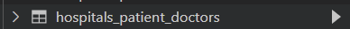
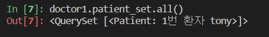
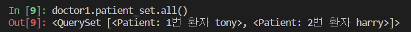
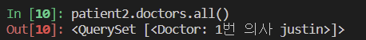
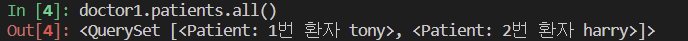
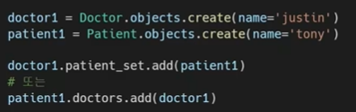

# 0508 TIL Django N:M


#### 병원 진료 기록 시스템


#### 1:N의 한계

```python
from django.db import models


class Doctor(models.Model):
    name = models.TextField()

    def __str__(self):
        return f'{self.pk}번 의사 {self.name}'


class Patient(models.Model):
    doctor = models.ForeignKey(Doctor, on_delete=models.CASCADE)
    name = models.TextField()

    def __str__(self):
        return f'{self.pk}번 환자 {self.name}'


# 코드 예시
doctor1 = Doctor.objects.create(name='justin')
doctor2 = Doctor.objects.create(name='eric')
patient1 = Patient.objects.create(name='tony', doctor=doctor1)
patient2 = Patient.objects.create(name='harry', doctor=doctor2)
patient3 = Patient.objects.create(name='tony', doctor=doctor2)
patient4 = Patient.objects.create(name='harry', doctor=doctor1, doctor2)
```


- 새로운 예약 생성이 불가능 (새 객체를 생성해야 함)
- 여러 의사로부터 진료 받은 기록을 환자 한 명에 저장할 수 없음
  - 외래 키에 '1, 2' 형태의 데이터 삽입 불가


#### 중개 모델

- 중개 모델(중개 테이블, Associative Table) 작성

  ```python
  from django.db import models
  
  class Doctor(models.Model):
      name = models.TextField()
  
      def __str__(self):
          return f'{self.pk}번 의사 {self.name}'
  
  # 외래키 삭제
  class Patient(models.Model):
      name = models.TextField()
  
      def __str__(self):
          return f'{self.pk}번 환자 {self.name}'
  
  # 중개모델 작성
  class Reservation(models.Model):
      doctor = models.ForeignKey(Doctor, on_delete=models.CASCADE)
      patient = models.ForeignKey(Patient, on_delete=models.CASCADE)
  
      def __str__(self):
          return f'{self.doctor_id}번 의사의 {self.patient_id}번 환자'
  ```

  ```shell
  doctor1 = Doctor.objects.create(name='justin')
  patient1 = Patient.objects.create(name='tony')
  
  Reservation.objects.create(doctor=doctor1, patient=patient1)
  
  doctor1.reservation_set.all()
  patient1.reservation_set.all()
  
  patient2 = Patient.objects.create(name='harry')
  Reservation.objects.create(doctor=doctor1, patient=patient2)
  ```

  ```shell
  for reservation in doctor1.reservation_set.all():
      print(reservation.patient.name)
  
  tony
  harry
  ```

  다대다 관계 형성


####  ManyToManyField

- 다대다, 중계테이블 생성, 두 클래스에는 아무런 변화가 없음 => 이것을 지원하는 장고의 필드
- 다대다 관계 설정 시 사용하는 모델 필드
- 하나의 필수 위치인자(M:N 관계로 설정할 모델 클래스)가 필요
- 작성 (중개 모델 삭제)
  - 필드 작성 위치는 Doctor or Patient 모두 가능

```python
from django.db import models


class Doctor(models.Model):
    name = models.TextField()

    def __str__(self):
        return f'{self.pk}번 의사 {self.name}'


class Patient(models.Model):
    # ManyToManyField 작성
    doctors = models.ManyToManyField(Doctor)
    name = models.TextField()

    def __str__(self):
        return f'{self.pk}번 환자 {self.name}'
```

- 환자쪽에 작성돼있음

  

- 환자가 아닌 닥터 클래스에 ManyToManyField를 만들면 아무 변화 없지만, 테이블 이름은 달라질 수 있음. 컬럼 순서 정도도 바뀔 수 있는데 상관은 없음.
- 1:N 관계에서는 한쪽이 종속되는데, M:N은 동등한 관계임


- Reservation 클래스(중개 테이블)에서는 서로 역참조였지만,
  - Reservation.objects.create(D, P)
- 이 상황에서는 필드가 일단 작성이 됐고, 필드 중심으로 참조 관계를 본다.
  - 의사 입장에서 환자를 볼 때는 역참조 `doctors`
    - 
    -  doctor1.patient_set.add(patient2)
    - 
    - 
    - 
  - 환자 입장에서 의사를 볼 때는 참조 `patient_set`
    - patient1.doctors.add(doctor1) = 환자 자신이 의사를 선택하여 예약
    - 

```shell
doctor1 = Doctor.objects.create(name='justin')
patient1 = Patient.objects.create(name='tony')
patient2 = Patient.objects.create(name='harry')

patient1.doctors.add(doctor1)			# 환자 1이 의사1을 추가 (참조)
patient1.doctors.all()
doctor1.patient_set.all()

doctor1.patient_set.add(patient2)		# 환자 2를 의사1가 추가 (역참조)
doctor1.patient_set.all()
patient2.doctors.all()
patient1.doctors.all()

doctor1.patient_set.remove(patient1)	# 의사1 입장에서 환자1 예약 취소 (역참조)
doctor1.patient_set.all()
patient1.doctors.all()

patient2.doctors.remove(doctor1)	# 환자2 입장에서 의사1 예약 취소 (참조)
patient2.doctors.all()
doctor1.patient_set.all()
```

- related_name을 통해서 역참조 네임을 바꿀 수 있다. (1:N에서는 별로 안 바꾸고, 다대다에서!!)
- 1:N에서는 클래스 변수를 단수형으로 했으나, MTM에서는 복수형으로 만듦!


#### related_name

- target model(관계 필드를 가지지 않은 모델)(의사)이 
- source model(관계 필드를 가진 모델)(환자)을 참조할 때 사용할 manager의 이름을 설정
- 즉, 역참조 시 사용하는 manager의 이름을 설정
- ForeignKey의 related_name과 동일
- 
  - Patient 클래스에서 doctors 변수를 만들 때, patient_set을 사용하므로, patients라고 명명
  - 이렇게 related_name 변경 시, DB 초기화까지는 필요 없고, makemigrations, migrate 다시 하셈
  - 
  - 이렇게 바꾸고나면, 이전에 사용하던 related_name (patient_set)은 사용 불가
  - 이렇게 바꾸면 어느쪽이 역참조였는지 굳이 생각할 필요없어짐 유용


#### 중개 모델 (테이블) in Django

- 장고는 MTMF을 통해 중개 테이블 자동 생성
- 그렇다면, 중개 테이블 직접 작성하는 경우는 없는가?
  - 단점: 서로간 사람 정보만 들어감. 진료는 몇시에 보며, 무슨 병명으로 보는지 알고 싶을 수도 있음. 이러한 부가정보가 없음. MTMF은 외래키 컬럼 2개로밖에 안 만들어짐. 이게 기본이라, 중개 테이블 추가정보는 직접 작성해야 함.


#### 요약

- 실제 Doctor와 Patient의 테이블의 변화는 없음
- 1:N 관계는 완전 종속 관계이지만,
- M:N 관계는 의사에게 진찰받는 환자, 환자를 진찰하는 의사으 두 가지 형태 모두 표현 가능


---

#### ManyToManyField 개념 및 특징

- 다대다 관계 설정 시 사용하는 모델 필드
- 하나의 필수 위치인자(M:N 관계로 설정할 모델 클래스)가 필요
- 모델 필드의 RelatedManager를 사용하여 관련 개체의 추가, 제거, 생성 가능
  - add(), remove(), create(), clear() ...
- [참고] RelatedManager : 일대다 or 다대다 관련 컨텍스트에서 사용되는 manager


#### 1. related_name

- target model이 source model을 참조할 때(역참조) 사용할 매니저의 이름을 설정
- foreignKey의 related_name과 동일

#### 2. through

- 중개테이블을 **직접 작성하는 경우**, 이 옵션을 사용
- 일반적으로 중개 테이블에 추가 데이터를 사용하는 다대다 관계를 연결하려는 경우

#### 3. symmetrical

- 나중ㅇ...


### Related Manager

- 1:N or M:N 관련 컨텍스트에서 사용되는 매니저
- 같은 이름 메서드여도 각 관계에 따라 다르게 사용, 동작
  - 1:N ==> target 모델 인스턴스만 사용 가능
  - M:N ==> 관련된 두 객체에서 모두 사용 가능
- 메서드 종류
  - add(), remove(), create(), clear(), set() 등


#### add()

- 지정된 객체를 관련 객체 집합에 추가
- 이미 존재하는 관계에 사용하는 관계가 복제되지 않음.
- 모델 인스턴스, 필드 값(PK)을 인자로 허용
- 


#### through 예시

```python
from django.db import models


class Doctor(models.Model):
    name = models.TextField()

    def __str__(self):
        return f'{self.pk}번 의사 {self.name}'


class Patient(models.Model):
    doctors = models.ManyToManyField(Doctor, through='Reservation')	#through 옵션 - 중개테이블을 직접 작성하는 경우
    name = models.TextField()

    def __str__(self):
        return f'{self.pk}번 환자 {self.name}'


class Reservation(models.Model):
    doctor = models.ForeignKey(Doctor, on_delete=models.CASCADE)
    patient = models.ForeignKey(Patient, on_delete=models.CASCADE)
    symptom = models.TextField()	# 증상
    reserved_at = models.DateTimeField(auto_now_add=True)	# 예약 시간

    def __str__(self):
        return f'{self.doctor.pk}번 의사의 {self.patient.pk}번 환자'
```


- shell_plus

  ```shell
  doctor1 = Doctor.objects.create(name='justin')
  patient1 = Patient.objects.create(name='tony')
  patient2 = Patient.objects.create(name='harry')
  
  # 1) 클래스를 통해서 만들 수도 있고,
  reservation1 = Reservation(doctor=doctor1, patient=patient1, symptom='headache')
  reservation1.save()
  doctor1.patient_set.all()
  patient1.doctors.all()
  
  # 2) 환자와 의사 입장에서도 만들 수 있지만, through_defaults={딕셔너리} 필요
  patient2.doctors.add(doctor1, through_defaults={'symptom': 'flu'})
  doctor1.patient_set.all()
  patient2.doctors.all()
  
  doctor1.patient_set.remove(patient1)
  patient2.doctors.remove(doctor1)
  
  ```


#### 중개 테이블 필드 생성 규칙

1. soucr model, target model 이 다른 경우
   - id
   - `patient`_id
   - `doctor`_id
2. MTMF가 동일한 모델(재귀적으로 자기자신)을 가리키는 경우
   - id
   - from_`model`_id
   - to_`model`_id


