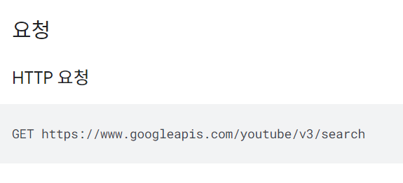
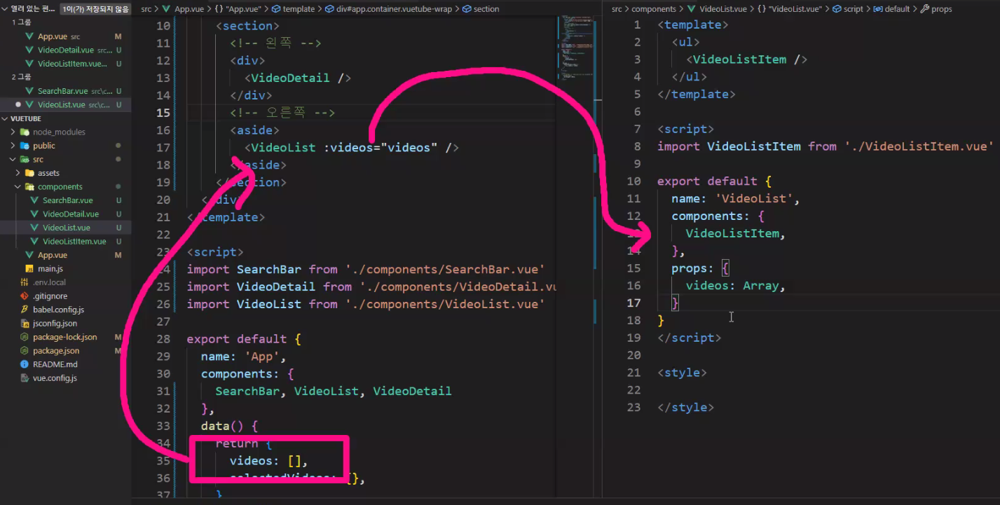
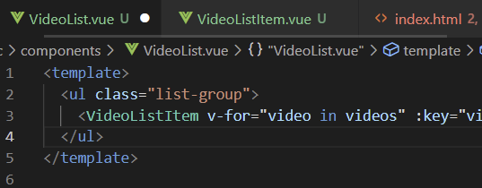

`npm install axios`

서치바뷰는 내가 검색을 시작하는 순간 검색한 결과에 따라 쿼리가 보이게 될 것임. 뷰를 이용해서 어떻게 구현? app.vue와 서치바 사이에 어떤 연관? 버튼을 누르면 내가 검색한 Q(query) 정보를 통해서 axios를 쏘게 하고 싶음.

이런거 생각해둬라 미리

검색 정보 결과를 emit event 할 거다~

하기 전에 POST MAN 켜기

https://developers.google.com/youtube/v3/docs/search/list

기본

필수 매개변수

- `part=snippet`을 설정하는 경우 API 응답은 중첩된 속성도 모두 포함합니다. (정보 많이 준대요. 이거쓰기루!)

- q 매개변수는 검색할 검색어를 지정

env local frame 어쩌구를 통해서 api 키를 숨길 방법은 있다고 한다.

items라는 리스트가 있는데, 이런 게 한 5개정도 왔다..?

items.snippet.thumnail.default.url 있는데, 이게 유튜브 썸네일 유알엘이라는 것임

vue create vuetube

(라우터 필요 없음. 뷰 안에 관리되고 있는 자식들이어서. 모든 파일들이 components안에 있으면 됨)

npm i lodash

npm i axios

npm run serve

cd src/components

touch SearchBar.vue VideoDetail.vue VideoList.vue VideoListItem.vue

깔끔한 시작을 위한 초기화 고고싱

---

시맨틱태그 기억나? head, article, section... 가독성때문에 씀. 여기는 navigation bar 정도는 없지만 header 정도는 만들어보겠음

레이아웃 보는 영역 자체

약간 왼쪽 공간 생김

세로 길이가 제일 작아봐야 전체 높이의 뭐..?가 되게 해주세요.

min height는 세로길이가 제일 작다 하더라도 view heigth의 100 = 길게 보겠다는 것임 200하면 내가 보고있는 viewheight의 2배

---

app.vue에 있는데, 자식 컴포넌트가 3개 있음 (videolistitem 외에 3개)

import > 등록

---

영역 나누기

---

aside태그는 본문 영역의 옆에 사용하는 태그

---

### app.vue와 search.vue의 관계 (axios, emit)

자세히 보면, props는 없음.

여태껏 그런 경우가 있었남

간단하게 짤 수 있겠군

---

왼쪽에 붙은 게 맘에 안들어

꾸며

---

api key 깃에 그대로 올리면 돈나가~

API 키 환경변수 설정!!

`.env.local`이라는 파일을 만든다.

그 안에 VUE_APP 접두사로 시작하는 어떤걸 보관하셈

`process.env`라고 부른대

----

input 결과랑 query 연결

---

methods 존재이유 : axios 보내기

그 안에 

---

---

---

---

몇개가 들어올지 모름. v-for를 하려면...

videolist가 있고, videolistitem들이 있을 때, for로 돌릴 건 알겠는데, 돌릴 주체는 어디서?

app.vue가 가지고 있던 videos리스트를 pass props할 거임

그 안에는 [{}]

---

videos 가지고 오고, props 넘길 때, videolist.vue에서는 array로 받음

장난질

---

videos는

서치바에서 쿼리 악시오스 받은 값을 어쩌구

에밋결과 (app.vue)를 들고있는 video를 바꾼 걸 프롭스한 거...

:video="video"는

프롭스임.

v-for에서 풀려나온 video가 그대로 video라는 이름으로 props로 들어가는 거임

그리고 저 파란 거는 video list item에 들어간단다...

---

video etag가 다 포함되어있는데, 꼬이지 않도록, :key="video.etag"를 했다...

---

결과값에 별거별거 다들어있어서 etag만 돌릴 수 있게 한 거임

- ETag(entity tag)는 웹 서버가 주어진 URL의 콘텐츠가 변경되었는지 알려주고 이를 반환하는 HTTP 응답 헤더이다.

---

이제 list styling

bootstrap

---

app.vue가 내려줄 땐 array

list가 item으로 내려줄 땐 object

넣을 게, 썸네일이미지, discription 있네

그럼 img, 

---

에러

---

스타일

---

---

---

---

어? 둘의 에밋이 다른데?

왼쪽은 this.video를 에밋한거고,

오른쪽은 에밋받은걸 onselect한 걸 에밋한거...

이제 selectedVideo를 채워줄 차례

app.vue!

s 오타!! 없애주기 (data 안에)

---

검색하는 순간 프롭프롭해서 뜬 결과고,

클릭하는 순간 에밋에밋 해서 채워진다(selectedVideo)

컨테이너 안에 row 안에 col은

로우가 결정되면 col은 12등분된다.

---

이제 videoDetail

detail

처음보는 iframe?

부트스트랩

emved/ 뒤는 아이디..

비디오 아이디 어디?

id.videoId

