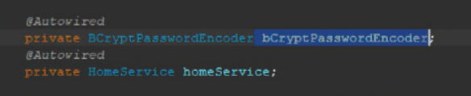
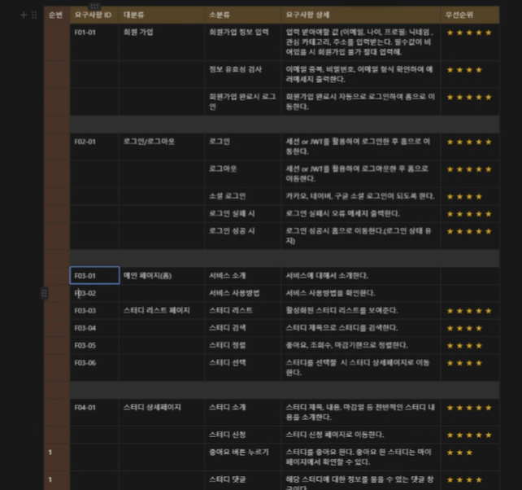
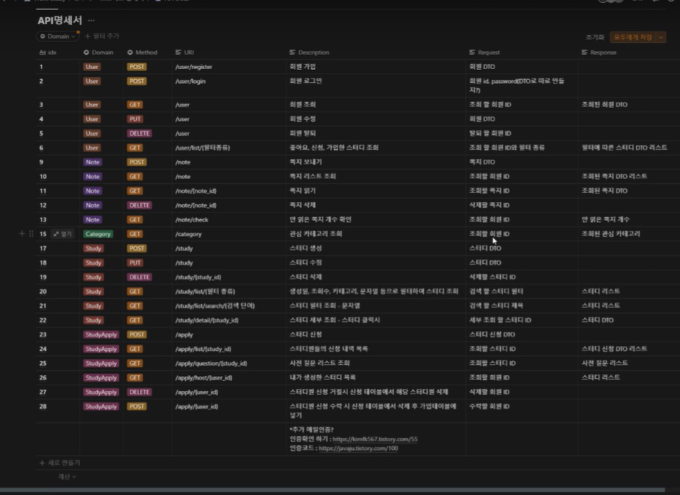

security config 설정 보면, 권한설정, 로그인 성공하면 가는 URL, 로그아웃, 권한 없으면 이동할 곳 등을 필터링해주는 곳. 회원가입을 안해서 해싱해서 db에 넣었더니 자꾸틀렸다고 나와서 로그인을 아직 안함. - 굳이 오래걸릴걸면 그렇게 안 해도 되고, 그냥 해싱 알고리즘 있잖아. 고민중이라 함.

mainboard 이름 바꾸기 (?)

상연 - 유저관리

아현 - 보드 중심 빌드

백단에서 페이지 이동이 되나? rest API

백단에서 던져주는 건 데이터 rest로만

특정 페이지로 이동해라는

페이지 새로고침할 때마다 로그인 페이지

클릭했을 때 rest api 호출하면

다른페이지로 이동한다음에 api를 호출해야한다.

vue + spring하려면 새로 구조를 다시 파야하는 문제가 있음

프론트가 데이터를 받아올 때, axios로 할 수 있나? rest api를 쉽게 호출하는 방법일 뿐이고, 그런 걸 보고 싶으면 postman

send 보내면 url로 데이터 요청 가능

백단에서 예를 들어, 회원 조회, 수정, 탈퇴가 있다면, /user잖아?

GET, PUT, DELETE 

("/user") 받겠지

이 안에서 get, put을 나눠서 처리하겠지

이때 들어오는 데이터가 있음 (회원 정보, id값, 세션아이디 등)

이걸 body에 임의로 적은 다음에 userID로 보내고 싶어.send를 보내면

요청된 url로 실제로 보내지 않아도

그건아는데, 이거는 간이잖아 사실 되는건지 확인하는 목적이고, 실제로 동작하는 제대로 된 페이지 이동을 볼 수 있냐는 거야. - 그거는 서로 둘다 프레임워크를 받아서 테스트해야됨.

프론트는 스프링 프레임워크를 받아서 서버를 동작시킨다음에 해보고,

백은 프론트 뷰 프레임워크 프로젝트를 받아서 뷰로 실행을 시켜서 돌려봐야함

근데 이런 문제를 해결하기 위해, 서버에 올려서 돌리게 되는데, 보통 개발이 거의 끝나갈 때

그럼 끝나갈 때까지는 프론트 페이지를 볼 수 없는가?

보통은 전자 방식으로 받아서 함. 깃에다가

기능요구사항 명세의 예

html css js 을 resouces에 담잖아

vue로 바꾸면 index.html만 바뀌고 component 쭉바뀜

사실상 우리가 하는 건 miniboard.js 로 이루어진 것들로만 거의 코딩하게 됨.

백에 username이라는 정보가 있다. 이 정보를 프론트로 받아와서 출력하려면, jsp라는 java로 된 페이지로 해야함. 그게 back단에서 스프링이기 때문임. jquery나 다른방법도 있긴함. jsp로 변수를 바꿔야 주고 받을 수 있어.

이 username 을 그냥 우리가 jsp가 아니라 html로 바꿨잖아. 이걸 할 수 있는 이유는 중간에 restAPI라는 일종의 규약을 가운데서 해주는 애가 있어. JSON 파일 내에 특정 규칙이 있음. 여기에는 항상 왼쪽에 배열이름, 데이터이름, value 두가지가 쭉 표로 있음.

API 명세의 예

뷰랑 제이쿼리

제이쿼리가 사실상 JS에 가까움

뷰는 디렉토리를 리팩토링 해야함.

제이쿼리는 자스에서 