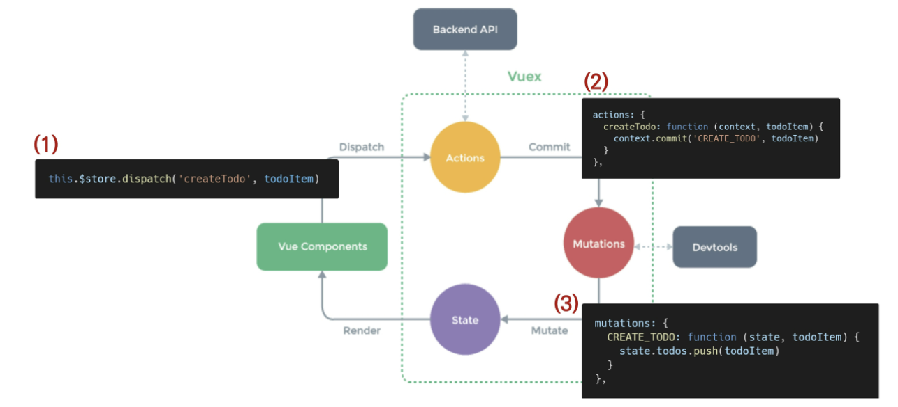

# 0511 TIL Vue 3


### 목차

- Vuex
- Vuex Core Concepts
- Todo app with Vuex


## Vuex


### Vuex Intro


#### Vue

> "Statement management pattern Library" for vue.js

 상태 관리 패턴 + 라이브러리

- 상태(state)를 전역 저장소로 관리할 수 있도록 지원하는 라이브러리
  - 상태가 예측 가능한 방식으로만 변경될 수 있도록 보장하는 규칙 설정
  - 애플리케이션의 모든 컴포넌트에 대한 `중앙 집중식 저장소` 역할
- Vue의 공식 devtools와 통합되어 기타 고급 기능을 제공


#### State

- state는 곧 data
- 해당 애플리케이션의 핵심 요소
- 중앙에서 관리하는 모든 상태 정보


#### 상태 관리 패턴

- 컴포넌트의 공유된 상태를 추출, 이를 전역에서 관리
- 컴포넌트는 커다란 view가 되며, 모든 컴포넌트는 트리 상관 없이 상태에 액세스 or 동작 트리거 가능
- 상태 관리, 특정 규칙 적용과 관련된 개념을 정의, 분리하여 코드 구조, 유지관리 기능 향상

- 트리거 : 특정 동작에 반응해 자동으로 필요 동작을 실행하는 것


#### 기존 Pass props & Emit event

- 각 컴포넌트는 독립적으로 데이터를 관리
- 데이터는 단방향 흐름으로 부모 => 자식 간 전달만 가능 (반대는 이벤트 트리거)
  - 장점 : 데이터 흐름 직관 파악
  - 단점 : 컴포넌트 중첩이 깊어지면 동위 관계 컴포넌트로의 데이터 전달이 불편해짐
- 공통 상태 공유 여러 컴포넌트가 있으면 데이터 전달 구조가 매우 복잡해짐 (지나치게 중첩된 컴포넌트를 통과하는 prop)
- 단방향 데이터 흐름
  - state : 앱 작동 원본 소스 (data)
  - view : state의 선언적 매핑
  - action : view에서 사용자 입력에 대해 반응적으로 state를 바꾸는 방법 (methods)


#### Vuex management pattern

- 중앙저장소(store)에 state를 모아놓고 관리

- 규모가 큰 (컴포넌트 중첩이 깊은) 프로젝트에서 매우 효율적

- 각 컴포넌트에서는 중앙 집중 저장소의 state만 신경 쓰면 됨

  - 동일 state를 공유하는 다른 컴포넌트들도 동기화 됨

    

#### 기존 pass props/ emit event VS vuex 비교


#### 단방향 흐름에 의존한 state(상태) 관리

##### 1. 부모 자식 간 컴포넌트 관계가 단순 or 낮은 깊이는 문제 X

- 몇 단계만 거치면 데이터 이동 쉽고 직관적 데이터 흐름 파악 가능

##### 2. BUT, 규모가 커지면 상태관리가 어려움

- 상태 공유 컴포넌트의 상태 `동기화 관리 어려움`
- 상태 전달 시, `상 => 하`로만 가능

##### 3. A컴포넌트의 상태를 공유하는 다른 컴포넌트에 pass props & emit event를 통해 동기화해야 함


#### Vuex를 활용한 state 관리

##### 1. 상태 변화 따른 여러 흐름을 모두 관리해야 하는 불편함을 해소할 필요 있음

- 상태는 데이터를 주고받는 컴포넌트 간 관계를 충분히 고려해야하므로, 상태 흐름 관리가 매우 중요!

##### 2. 상태를 `올바르게 관리하는 저장소`의 필요성 증가

- 상태를 한 곳(store)에 모두 모아 관리하자!
- 상태 변화는 모든 컴포넌트에서 공유!
- 상태 변화는 오직 Vuex가 `관리` => 해당 상태 공유중인 모든 컴포넌트는 변화에 `반응`

##### 3. A컴포넌트와 같은 상태를 공유하는 타 컴포넌트는 신경 안 쓰고, 오로지 상태 변화를 Vuex에 알림


## Vuex Core Concepts

### Vuex 핵심 컨셉

1. State
2. Mutations
3. Actions
4. Getters


#### 1. State

> 중앙에서 관리하는 모든 상태 정보 (data)

- Vuex는 single state tree 사용
- 이 단일 객체는 모든 app state를 포함하는 원본소스 역할을 함
- 각 app마다 한 개의 저장소만 갖게 됨

- 여러 컴포넌트 내부 특정 state를 중앙에서 직접 관리
  - 이전방식은 state 찾으려면 각 컴포넌트 직접 확인 필요
  - vuex를 통해 Vuex Store에서 각 컴포넌트에서 사용하는 state 한 눈 파악 가능!
- State 변화 시, 해당 state 공유중인 여러 컴포넌트의 DOM은 알아서 렌더링됨
- 이제 각 컴포넌트는 Vuex Store에서 state 정보를 가져와서 사용한다.


#### 2. Mutations

> 실제로 state를 변경하는 유일한 방법

- mutation의 handler(핸들러 함수)는 반드시 동기적이어야 함
  - 비동기적 로직(콜백함수 등)은 state 변화 시점이 의도와 달라질 수 있음
  - 콜백이 실제 호출될 시기 추적 불가
- 첫 인자로 항상 `state`를 받음
- Actions에서 `commit()`메서드에 의해 호출됨 => state를 변경


#### 3. Actions

- Mutations와 유사함.
- 차이점
  - state 변경 대신 mutations를 `commit()`메서드로 호출하여 실행
  - mutations와 달리 비동기 작업 포함 가능성 (백엔드 api와 통신하여 data fetching 등 작업)
- `context` 객체 인자를 받음
  - context 객체를 통해 store/index.js 파일 내 모든 요소의 속성 접근 + 메서드 호출 가능
  - 단, state 직접 변경은 X
- 컴포넌트에서 `dispatch()`메서드에 의해 호출됨

> Actions를 통해 state 조작할 수 있지만, state는 오직 Mutations를 통해서만 조작 해야함

`명확한 역할 분담`을 통해 서비스 규모 증가에도 state의 올바른 관리를 위함

- 컴포넌트의 dispatch()에 의해 호출되어 commit()으로 mutations 호출


#### 4. Getters

state 변경 없이 활용하여 계산 수행 (computed와 유사)

- compute 사용처럼, getters는 저장소 상태 기준으로 계산
  - ex) state에 todoList의 경우, 완료된 todo 목록만 필터링 출력

- computed 속성처럼 getters 결과는 state 종속성 따라 캐시됨(cashed), 종속성 변경 시에만 재계산됨
- getters 자체가 state 변경은 X
  - state를 특정 조건 따라 구분, 계산만 하여 계산된 값을 가져온다.


### 정리

- State
  - 중앙 관리 모든 상태 정보 (data)
  - Mutations에 의해 변경됨
- Mutations
  - state 변경 유일 방법
  - 반드시 동기적 로직
  - 첫 인자 state
  - Actions의 commit()으로 호출됨
- Actions
  - Mutations를 commit()으로 호출
  - 비동기 로직 작성 가능
  - 항상 context 객체를 받으므로 모든 속성 접근은 가능하지만 state 변경 금지
  - 컴포넌트에서 dispatch()에 의해 호출도미
- Getters
  - store의 상태를 기반하는 계산 값
  - 실제 상태 변경 X
  - computed 속성과 비슷


### Vuex Todo App

1. Set project & components
2. Create Todo
3. Delete
4. Update
5. Getters
6. Vuex component binding helper
7. Local storage


#### Todo App 소개

- 컴포넌트 구성

  

- 결과 예시

  


### Set project & components

#### Init project

1. Create Project

   ```bash
   $ vue create todo-vuex-app
   $ cd todo-vuex-app
   ```

2. Add Vuex plugin in Vue CLI

   `$ vue add vuex`

3. commit 여부 - `Yes`


#### Vuex로 인한 변화

1. store 디렉토리 생성
2. index.js 생성
   - Vuex core concepts가 작성 되는 곳
   - 


#### 컴포넌트 작성

- TodoListItem.vue

  - 개별 todo 컴포넌트
  - TodoList 컴포넌트의 자식 컴포넌트

  ```html
  // components/TodoListItem.vue
  
  <template>
  	<div>Todo</div>
  </template>
  
  <script>
  export default {
  	name: 'TodoListItem',
  }
  </script>
  ```

  

- TodoList.vue

  - todo 목록 컴포넌트
  - TodoListIteml 컴포넌트의 부모

  ```html
  // components/TodoList.vue
  
  <template>
  	<div>
      	<todo-list-item></todo-list-item>
      </div>
  </template>
  
  <script>
  import TodoListItem from '@/components/TodoListItem'
      
  export default {
  	name: 'TodoList',
      components: {
          TodoListItem,
      }
  }
  </script>
  ```

- TodoForm.vue

  - todo 데이터를 입력 받는 컴포넌트

  ```html
  // components/TodoForm.vue
  
  <template>
  	<div>Todo Form</div>
  </template>
  
  <script>
  export default {
  	name: 'TodoForm',
  }
  </script>
  ```

- App.vue

  - 최상위 컴포넌트
  - TodiList, TodoForm 의 부모

  ```html
  // App.vue
  
  <template>
  	<div id='app'>
          <h1>TodoList</h1>
      	<todo-list></todo-list>
          <todo-form></todo-form>
      </div>
  </template>
  
  <script>
  import TodoList from '@/components/TodoList'
  import TodoForm from '@/components/TodoForm'
      
  export default {
  	name: 'App',
      components: {
          TodoList,
          TodoForm,
      }
  }
  </script>
  ```

  


## Create Todo


### State 작성

state에 2개의 todo 작성

- 주의 : Vuex 쓴다고, Store에 모든 상태를 넣어야 하는 건 아님

```javascript
// index.js

export default new Vuex.Store({
    state: {
        todos: [
            {
                title: '할 일1',
                isCompleted: false,
                date: new Date().getTime(),
            },
            {
                title: '할 일2',
                isCompleted: false,
                date: new Date().getTime(),
            },
        ]
    },
    ...
})
```


#### TodoList 데이터 가져오기

컴포넌트에서 Vuex Store의 state에 접근 `$store.state`

```html
// components/TodoList.vue

<template>
	<div>
    	<todo-list-item v-for="todo in $store.state.todos" :key="todo.date">		</todo-list-item>
    </div>
</template>

<script>
import TodoListItem from '@/components/TodoListItem'
    
export default {
	name: 'TodoList',
    components: {
        TodoListItem,
    }
}
</script>
```


#### Computed로 변경

- 현 state의 todo는 값이 변화하는 게 아님.
- store에 저장된 todo 목록을 가져오는 것이므로, 매번 새로운 호출은 비효율적

- 대신, todo 추가 등 변경사항 발생 시에만, 새로 계산한 값을 반환하는 방향으로 변경 (computed)
- `this(Vue Instance)`로 접근

```html
// TodoList.vue

<template>
	<div>
    	<todo-list-item 
             v-for="todo in todos" 
             :key="todo.date">
        </todo-list-item>
    </div>
</template>

<script>
import TodoListItem from '@/components/TodoListItem'
    
export default {
	name: 'TodoList',
    components: {
        TodoListItem,
    },
    computed: {
        todos: function() {
            return this.$store.state.todos
        }
    }
}
</script>
```


#### Pass Props (TodoList => Todo)

```html
// TodoList.vue
<template>
	<div>
    	<todo-list-item 
             v-for="todo in todos" 
             :key="todo.date"
             :todo="todo">
        </todo-list-item>
    </div>
</template>
```

```html
// TodoListItem.vue
<template>
	<div>{{ todo.title }}</div>
</template>

<script>
export default {
	name: 'TodoListItem',
    props: {
        todo: {
            type: Object,
        }
    }
}
</script>
```


#### Actions & Mutations

- createTodo 메서드를 통해 createTodo Action 함수 호출 (dispatch())

```html
// TodoForm.vue

<template>
	<div>
    	<input type="text" v-model.trim="todoTitle" @keyup:enter="createTodo" />
        <button @click="createtodo">Add</button>
    </div>
</template>

<script>
export default {
	name: 'TodoForm',
    data: function () {
        return {
            todoTitle: '',
        }
    },
    methods: {
        createTodo: function () {
            const todoItem = {
                title: this.todoTitle,
                isCompleted: false,
                date: nuw Date().getTime(),
            }
        	if (todoItem.title) {
    			// this.$store.commit('CREATE TODO', todoItem)
    			this.$store.dispatch('createTodo'. todoItem)
    		}
            this.todoTitle = ''
        },
    },
}
</script>
```


#### Actions & Mutations

- Actions
  - createTodo 함수
  - CREATE_TODO mutation 함수 호출
- Mutations
  - CREATE_TODO 함수
  - State의 todo 데이터 조작

```javascript
// index.js

export default new Vuex.Store({
    state: {
        todos: [],
    },
    mutations: {
        CREATE_TODO: function (state, todoItem) {
           state.todos.push(todoItem)
        }
    },
    actions: {
        createTodo: function (context, todoItem) {
            context.commit('CREATE_TODO', todoItem)
        }
    }
    ...
})
```


#### Actions의 "context" 객체

- Vuex store의 전반적인 맥락 속성을 모두 포함하고 있음
  - SO, context.commit을 호출하여 mutations을 호출하거나,
  - context.state와 context.getters를 통해 state, getters에 접근 가능
    - dispatch()로 다른 actions도 호출 가능
- **할 수 있지만 actions에서 state 조작 금지**

```javascript
actions: {
    createTodo: function (context, todoItem) {
        console.log(context)
        console.log(context.state)
        console.log(context.getters)
        console.dispatch(...)
		console.commit('CREATE_TODO', todoItem)
        
    }
}
```


#### Vuex 상태 관리 흐름



#### Mutations handler name

Mutations 함수의 이름은 상수(ALL CAPITAL) 작성 권장

​	linter와 같은 tool에서 디버깅하기에 유용, 전체 app에서 어떤게 mutations인지 빠른 파악 가능


#### JS Destructuring assignment

- 배열 값이나 객체 속성을 고유한 변수로 압축 해제할 수 있는 JS 표현식


- actions 변경

  


## Delete Todo


#### TodoListIteml 컴포넌트

deleteTodo action 함수 호출

```html
// TodoListItem.vue
<template>
	<span>{{ todo.title }}</span>
    <button @click="deleteTodo">Delete</button>
</template>

<script>
export default {
	name: 'TodoListItem',
    props: {
        todo: {
            type: Object,
        }
    },
    methods: {
        deleteTodo: function () {
            this.$store.dispatch('deleteTodo', this.todo)
        },
    }
}
</script>
```


#### actions & Mutations

```javascript
// index.js

actions: {
    ...,
    deleteTodo({ commit }) {
        commit('DELETE_TODO', todoItem)
    }
}
```

```javascript
// index.js

mutations: {
	...,
    DELETE_TODO(state, todoItem) {
        // 1. todoItem이 첫번째로 만나는 요소의 index를 가져옴
        const index = state.todos.indexOf(todoItem)
        
        // 2. 해당 index 1개만 삭제하고 나머지 요소를 토대로 새 배열 생성
        state.todos.splice(index, 1)
    }
}
```


## Update Todo


#### TodoListItem

updateTodoStatus action 함수 호출

```html
// TodoListItem.vue
<template>
	<span @click="updateTodoStatus" >{{ todo.title }}</span>
    <button @click="deleteTodo">Delete</button>
</template>

<script>
export default {
	name: 'TodoListItem',
    props: {
        todo: {
            type: Object,
        }
    },
    methods: {
        ...,
        updateTodoStatus() {
    		this.$store.dispatch('updateTodoStatus', this.todo)
		}
    }
}
</script>
```

#### Actions & Mutations

```javascript
// index.js

actions: {
    ...,
    updateTodoStatus: function ({ commit }, todoItem) {
        commit('UPDATE_TODO_STATUS', todoItem)
    }
}
```

```javascript
// index.js

mutations: {
    UPDATE_TODO_STATUS: function (state, todoItem) {
        //4. 배열 각 요소에 함수가 적용된 새 배열을 state.todos에 할당
        state.todos = state.todos.map(todo => {
        // 1. todoItem이 첫번째로 만나는 요소의 index를 가져옴
        if (todo === todoItem) {
            return {
                title: todoItem.title,
                date: new Date().getTime()
                isCompleted: !todo.isCompleted
            }
        } else {
            // 3. 일치하지 않으면 기존 배열 return
            return todo
        }
     })
   }
},
```


#### Javascript Spread Syntax

> 전개 구문

배열, 문자열 등의 반복가능(iterable) 문자를

요소(배열은 리터럴의 경우)로 확장하여, 

0개 이상의 key-value 쌍으로 된 객체 확장 가능


'...'을 붙여서 요소 or 키가 0개이상의 반복가틍 객체를 하나의 객체로 간단 표현하는 법

ECMAScript2015에서 추가됨

Spread Syntax의 대상은 반드시 iterable 객체여야 함


- 주 사용처
  1. 함수 호출
     - 배열 목록을 함수 인수로 활용 시
  2. 배열
     - 배열 연결
     - 배열 복사
  3. 객체
     - 객체 복사


- 객체에서의 전개 구문
  - 객체 복사 (shallow copy)
    - 
    - 
  - Mutations 변경
    - 변경 전 : `title: todoItem.title,`
    - 변경 후: `...todo,`


- 취소선 긋기

  v-bind를 사용한 클래스 바인딩

  

​	

## Getters


#### getters 정의, 활용

- 완료된 todo 개수 계산

  

  - getters 사용, computed 반환 값으로 사용

    

- 완료되지 않은 todo 개수 계산

  

  - getters 사용, computed 반환 값으로 사용

  

- 전체 todo 개수 계산

  

  - getters 사용, computed 반환 값으로 사용

    


---

## Component Binding Helper

JS Array Helper Method를 통해 배열 조작을 편하게 하는 것과 유사

​	논리적 코드 자체의 변화가 아니라, 쉽게 사용가능하도록 초점

종류

- mapState
- mapGetters
- mapActions
- mapMutations
- createNamespaceHelpers


#### mapState

- computed와 Store의 state를 매핑
- Vuex Store의 하위 구조를 반환하여 component 옵션을 생성함
- 매핑된 computed 이름이 state 이름과 같을 때 문자열 배열 전달 가능


-p.81