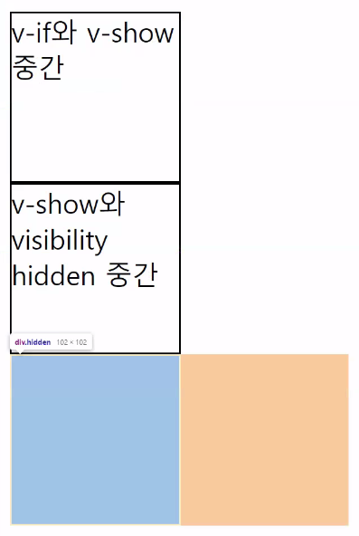

# 0511 TIL

**헷갈리는 디렉티브**

- v-if

- v-show
  - 조건부 렌

- visibility hidden

공통점: 사람 눈에 안 보임

1. v-if
2. 구분
3. v-show
4. 구분
5. visibility hidden

인라인은 왼쪽에서 오른쪽으로 쌓이고, 일반적인 박스는 위에서 아래로 쌓임

박스는 5개 쌓엿는데, 우리가 보는 건 2,4번 박스밖에 없음

border는 테두리 속성을 한 번에 설정할 수 있음

5번박스는 순수 CSS이고, 1,3은 view와 관련

5번박스는 실제로 마크업이 존재는 하는데(자리는 차지하는데) 우리 눈에 안 보임. 이게 CSS

그다음, v-show는 안보임 (display none)

display는 none, inline, block, inline block, flex가 있음.

디스플레이를 듣자마자 떠올려야 할 것은 레이아웃 (요소의 배치와 관련)

3. v-show는 display none으로 클래스가 있는데, 레이아웃에 영향을 주지 않는 상태

1. 존재하지도 않음 (v-if = false)

v-if, show는 디스플레이

modal은 display none과 block으로 토글?한다고 함.

v-if는 directive 표현식이 true일 때만 `렌더링`된다 (false는 렌더링 자체가 안됨)

v-show는 렌더링은 되는데 display none이므로 레이아웃에는 영향 X

visibility hidden 은 렌더링도, 레아이웃에 영향도 주는데 , 눈에만 안 보임

---

vue에서 경로 @는 src를 뜻함. 추후 프젝 시 사람들과 정해두기~

---

