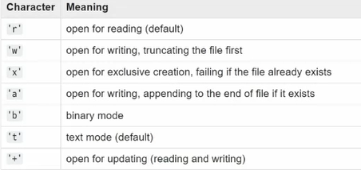

# 파이썬을 활용한 데이터 수집 1


### 파일 입력

- open (file, mode='r', encoding=None)

  - file : 파일명

  - mode : 텍스트 모드

  - encoding: 인코딩 방식 (일반적으로 utf-8 활용)

    

    

    open이라는 함수에 file명을 인수로 받고, r, None은 기본값으로 되어 있음.


### 파일 입력 활용법

- 파일 객체 활용

  `f = open('workfile', 'w')`

- with 키워드 활용

  ```python
  with open('workfile') as f:
  	read_data = f.read()
  	 
  # We can check that the file has been automatically closed.
  f.closed		# True
  ```

- with 키워드 미사용 시, f.close()를 반드시 호출해서 종료시켜야 오류가 발생하지 않는다. 따라서, 일반적으로 with 키워드를 활용하여 작성


### JSON (JavaScript Object Notation)

- 자바스크립트 객체 표기법
- 개발환경에서 많이 활용되는 데이터 양식
- 웹 어플리케이션에서 데이터 전송 시 일반적으로 사용
- 문자 기반 데이터 포멧
  - 다수 프로그래밍 환경에서 쉽게 활용 가능
  - 텍스트 => 언어별 데이터 타입
  - 언어별 데이터 타입 => 텍스트


### 딕셔너리 접근 방법

- dict.get(key, default)
  - KeyError
- dict[key]
  - None


